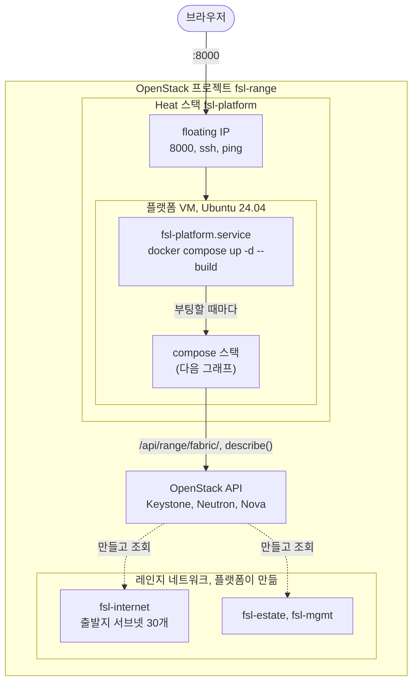
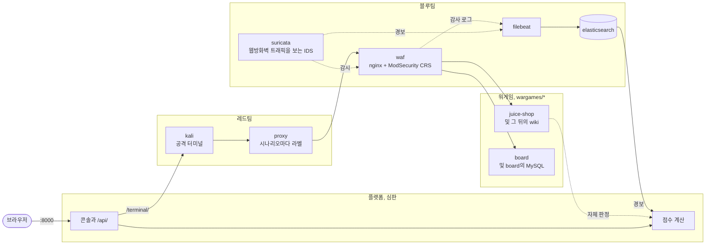

# fsl-project-mvp

사이버 공격·방어 훈련 레인지입니다. 레드팀은 OWASP Juice Shop이나 MySQL 위에서
도는 Django 게시판을 공격하고, 블루팀은 Suricata와 ModSecurity로 이를 방어하며,
플랫폼은 양쪽이 각각 무엇을 이뤘는지 점수를 매깁니다. 이 저장소는 버릴
프로토타입이고, 실제 제품 프로젝트는 다른 곳에 있습니다.

- `CLAUDE.md`: 저장소의 목적, 점수 방식, 작업 규칙
- `docs/ARCHITECTURE.md`: 레인지의 구성 방식과 앞으로의 방향 (한국어판 `docs/ARCHITECTURE.ko.md`)
- `docs/THREAT-MODEL.md`: 레인지가 모사하는 것과 빼 둔 것
- `docs/STATE.md`: 작업이 어디까지 왔는지
- `README.md`: 이 README의 영어 원문

## 전체 구성

### 실행 환경

OpenStack 클라우드에서는 스택 전체가 VM 하나 안에서 돌고, 그 VM은 Heat 스택
하나(`deploy/openstack/platform.yaml`)가 만듭니다. 플랫폼은 member 역할 사용자
`fsl-range`로 OpenStack API를 통해 레인지를 읽습니다. 다만 점수를 매기는 레인지는
아직 VM 안의 Docker 레인지입니다(`docs/STATE.md`의 백로그 2번이 이를 OpenStack으로
옮깁니다).



### 스택 내부

레드팀은 블루팀의 방어를 거쳐 워게임을 공격합니다. 블루팀의 센서는
Elasticsearch에 기록을 남깁니다. 플랫폼은 심판으로서 그 경보와 대상 시스템 자신의
판정으로 점수를 매깁니다. 플랫폼, 레드팀, 블루팀은 최상위 `compose.yaml`에
있습니다. 워게임은 각각 `wargames/` 아래의 폴더 하나이고 최상위 `compose.yaml`이
이를 포함합니다. 그래서 새 워게임은 새 폴더 하나와 `include:` 한 줄이면 됩니다.



선이 복잡해지지 않도록 그래프에서 뺀 것이 있습니다. Kali의 raw TCP는 프록시를
거치지 않고 웹방화벽으로 바로 갑니다. 플랫폼은 스크립트 시나리오(공격과 정상
트래픽)를 웹방화벽에 직접 보냅니다. 또 플랫폼은 기반 계층(여기서는 `docker exec`,
OpenStack에서는 ssh)을 통해 센서의 룰과 프록시의 시나리오 라벨을 쓰고, wiki의
읽기 로그와 공격자의 명령 로그를 읽습니다. 네트워크 구성은 `docs/ARCHITECTURE.md`에
있습니다.

## 스택 띄우기

Docker가 있는 호스트에서 저장소를 clone하고 스택을 띄웁니다.

```bash
docker compose up -d --build
```

플랫폼이 시작할 때 docker 소켓 그룹을 맞추고 Elasticsearch ingest pipeline(출발지
주소의 지리적 위치를 추정합니다)을 등록하므로, 따로 실행할 것은 없습니다.
명령줄에서 스크립트 시나리오를 실행하거나 `bin/verify`를 돌리려면(`--fast`
포함) virtualenv가 필요합니다.

```bash
python3 -m venv .venv && .venv/bin/pip install -r platform/requirements.txt
```

| 포트 | | 사용처 |
|---|---|---|
| 8000 | 콘솔, `/api/`, `/terminal/`의 공격자 터미널 | 사람의 브라우저 |
| 8080 | 웹방화벽을 거친 대상 시스템 | 명령줄 시나리오와 인수 테스트 |
| 9200 | Elasticsearch | 인수 테스트 |

사람에게 필요한 포트는 8000 하나입니다. 플랫폼 이미지 안의 nginx가 이 포트를 받아
`/terminal/`을 Kali의 ttyd로 넘기고, ttyd는 자기 포트를 따로 공개하지 않습니다.
Mac에서는 모든 포트를 `127.0.0.1`에만 공개합니다. 플랫폼 VM에서는 8000을 VM 자기
주소에 공개합니다(`.env`의 `FSL_PUBLISH`). 레인지 안에서는 두 대상 시스템 모두
웹방화벽 뒤 80번 포트에 있습니다. Juice Shop은 `http://shop.com`(`edge`
네트워크에서만), 게시판은 `http://board.com`(모든 edge 네트워크에서)입니다. 세션은
`{"scenario": "board"}`로 만들지 않으면 Juice Shop을 대상으로 합니다.

### OpenStack에서

`deploy/openstack/platform.yaml`은 플랫폼 VM용 Heat 템플릿입니다. 이 템플릿이
무엇을 만들고 첫 부팅 때 무엇을 하는지는 `docs/ARCHITECTURE.md`("Built: the
platform VM")에 있습니다. 프로젝트 멤버로서, 프로젝트의 openrc를 source하고
`python-heatclient`를 설치한 상태에서 실행합니다.

```bash
openstack stack create -t deploy/openstack/platform.yaml --parameter keystone=http://KEYSTONE:5000 fsl-platform
```

`keystone`은 `/v3`를 뺀 Keystone 기본 URL입니다. `/v3`는 플랫폼이 붙입니다.
사용자는 `default` 도메인에서 찾고, 프로젝트는 스택이 속한 프로젝트를 씁니다.
비밀번호는 절대 스택에 넣지 않습니다. Nova는 인스턴스의 user data를 보관하고,
메타데이터 서비스는 이를 VM에서 도는 모든 것에 내줍니다. 레인지의 컨테이너도
예외가 아닙니다. 스택의 `address`가 ssh에 응답하면, 비밀번호가 명령줄에 한 번도
나타나지 않도록 파일에서 읽어 추가하고 플랫폼을 다시 만듭니다.

```bash
{ printf 'FSL_OPENSTACK_PASSWORD='; cat PASSWORD_FILE; echo; } | ssh ubuntu@ADDRESS 'cloud-init status --wait >/dev/null && cat >> /opt/fsl/openstack.env && sudo docker compose -f /opt/fsl/compose.yaml up -d platform'
```

| 파라미터 | 기본값 | |
|---|---|---|
| `ref` | `dev` | clone할 브랜치나 태그 |
| `repository` | GitHub의 이 저장소 | |
| `user` | `fsl-range` | 플랫폼이 로그인할 Keystone 사용자 |
| `key_name` | `fsl-claude` | `ssh ubuntu@ADDRESS`에 필요한 개인 키가 속한 키페어 |
| `image` | `ubuntu-24.04` | |
| `flavor` | `m1.windows` | |
| `external_network` | `provider` | |
| `cidr` | `10.20.0.0/24` | compose 서브넷이나 `172.17.0.0/16`과 겹치면 안 됨 |
| `dns` | `8.8.8.8,8.8.4.4` | |

스택의 `address` 출력값이 floating IP이고, 콘솔은 `http://ADDRESS:8000/`에서 바로
열립니다. 아직 로그인은 없습니다. 나머지 포트는 VM의 loopback에만 있습니다.

VM에서 checkout 위치는 `/opt/fsl`이고 소유자는 `ubuntu`입니다. compose,
`bin/backup`, 아래의 복원 절차는 거기서 실행합니다. 마지막 부팅 때 스택이 어떻게
올라왔는지는 `systemctl status fsl-platform`으로 봅니다.

비밀번호를 넣고 나면 플랫폼이 레인지의 네트워크를 만듭니다. 플랫폼 자신의 API를
호출합니다.

```bash
curl -s -X POST -H "Content-Type: application/json" -d "{}" http://ADDRESS:8000/api/range/fabric/
```

같은 경로에 `GET`을 보내면 없는 것, 있는 것, 설정이 어긋난 것, 선언에 없는데 남아 있는 것을
보여 줍니다. `DELETE`는 네트워크를 내리지만, 그 위에 서버가 있는 동안에는
거부됩니다.

`openstack stack delete fsl-platform`은 이 모두를 지웁니다.

스택은 `key_name`이 가리키는 키페어로 부팅하므로, 그 키페어가 프로젝트에 먼저
있어야 합니다.

```bash
openstack keypair create --public-key PUBLIC_KEY_FILE fsl-claude
```

## 라운드 진행

http://localhost:8000 을 열고 세션을 시작한 뒤, 레드 콘솔과 블루 콘솔을 나란히
엽니다. 헤더의 표시 언어 버튼으로 영어와 한국어를 전환합니다.

- **레드**에는 목표, Kali 셸, 스크립트 시나리오가 있습니다. 실행한
  시나리오에는 나가는 길에 라벨이 붙습니다. 또는 시나리오 이름을 정하고
  시작을 누른 뒤 셸에서 작업하고 중지를 누를 수도 있습니다. 그 사이에 보낸 모든
  것이 그 이름의 시나리오로 묶입니다.
- **블루**에는 대시보드, 실시간 경보, 점수판, Suricata 룰이 있습니다. 경보는 일정
  간격으로 수집합니다. 경보를 누르면 그 경보의 Elasticsearch 원본 로그가 열립니다.

Juice Shop용 스크립트 시나리오는 인수 테스트처럼 명령줄에서도 실행할 수
있습니다.

```bash
.venv/bin/python redteam/run.py
```

## 검증

```bash
bin/verify --fast     # unit and API tests and the metrics, no stack needed
bin/verify            # also the acceptance tests in test/, against the live stack
```

전체 실행은 플랫폼을 재시작하고 대상 시스템, 룰, 공격자의 출발지를 초기화합니다.
그러니 누가 쓰고 있는 스택에는 돌리지 마세요. 세션은 그 실행이 직접 만든 것만
지웁니다. `bin/prune`은 세션을 수동으로 지우며, `--apply` 없이 실행하면 dry
run입니다.

```bash
bin/prune --keep 20 --apply      # keep the newest 20
bin/prune --ids FILE --apply     # only the closed sessions FILE lists
```

템플릿에 Tailwind 클래스를 추가했으면 `bin/build-css`를 실행합니다. 콘솔이 인터넷
없이도 렌더링되도록 스타일시트는 생성해서 커밋해 둡니다. 스타일시트가 최신이
아니면 테스트가 실패합니다.

## 백업과 복원

플랫폼의 데이터(세션, 시나리오, 탐지, 목표, 탐지정책, 억제)는 SQLite 파일
하나로, `fsl_platformdata` 볼륨의 `/data/db.sqlite3`입니다. 그 밖에는 아무것도
백업하지 않습니다. Elasticsearch의 `fsl_esdata` 볼륨, `fsl_filebeatdata`에 있는
Filebeat의 registry, `fsl_waflogs`에 있는 ModSecurity의 감사 로그,
`deploy/suricata/logs`에 있는 일반 파일인 Suricata의 `eve.json` 모두 백업 대상이
아닙니다. `docker compose down -v`는 볼륨 네 개를 지우고 그 파일은 남깁니다.

```bash
bin/backup      # writes backups/db-<UTC time>.sqlite3 while the platform serves
```

SQLite의 온라인 백업 API를 쓰고, 복사본을 `PRAGMA integrity_check`로 검사하며,
어느 단계든 실패하면 아무것도 남기지 않습니다. Docker 밖에 있는 플랫폼에
접근하려면, 플랫폼 설정을 import할 수 있는 상태로 `python -`을 실행하는 명령을
`FSL_PLATFORM_EXEC`에 지정합니다.

복원은 플랫폼을 멈춘 상태에서 수동으로 합니다.

```bash
docker compose stop platform
docker run --rm --network none --entrypoint sh --user fsl \
  -v fsl_platformdata:/data -v "$PWD/backups:/backups:ro" fsl-platform \
  -c 'rm -f /data/db.sqlite3-journal && cp /backups/db-20260925T020000Z.sqlite3 /data/db.sqlite3'
docker compose start platform
```

이미지의 entrypoint는 인자를 무시하고 서버를 시작하므로 `--entrypoint sh`로
바꿉니다. 이미지 자체는 root로 돕니다. `--user fsl`을 주면 복사본의 소유자가
플랫폼 사용자가 됩니다. `docker cp`를 쓰면 root 소유로 남아 쓸 수 없게 됩니다.
이전 `-journal` 파일은 지워야 합니다. 남아 있으면 SQLite가 복원한 파일 위에 이를
재생합니다. 플랫폼은 시작할 때 백업 이후에 생긴 마이그레이션을 적용합니다. 복사
단계는 임시 볼륨에서 확인했습니다(`fsl` 소유로 들어갑니다). 절차 전체를 실행 중인
스택에서 돌려 보지는 않았습니다.

## 로컬 실습 전용

Elasticsearch는 보안 기능 없이, Django는 `DEBUG=1`로 돕니다. Django는
`DJANGO_ALLOWED_HOSTS`에 더 지정하지 않는 한 `localhost`, `127.0.0.1`, `[::1]`에만
응답합니다. 플랫폼 VM은 여기에 자기 floating IP를 더합니다. 플랫폼에는 Docker
소켓이 마운트되어 있고, `/terminal/`의 Kali 셸은 인증 없는 root 셸입니다. 둘 다
컨테이너 탈출 경로입니다.

플랫폼 VM에서도 마찬가지입니다. 게다가 VM에서는 프로젝트 비밀번호가
`/opt/fsl/openstack.env`와 플랫폼 컨테이너의 환경 변수에 평문으로 들어 있습니다.
VM의 ssh와 8000은 모든 주소에 열려 있고, 8000은 로그인을 묻지 않습니다.
