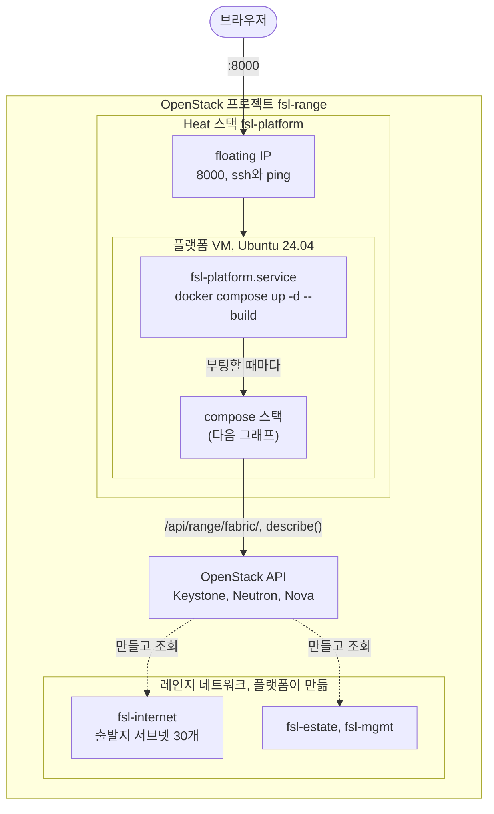
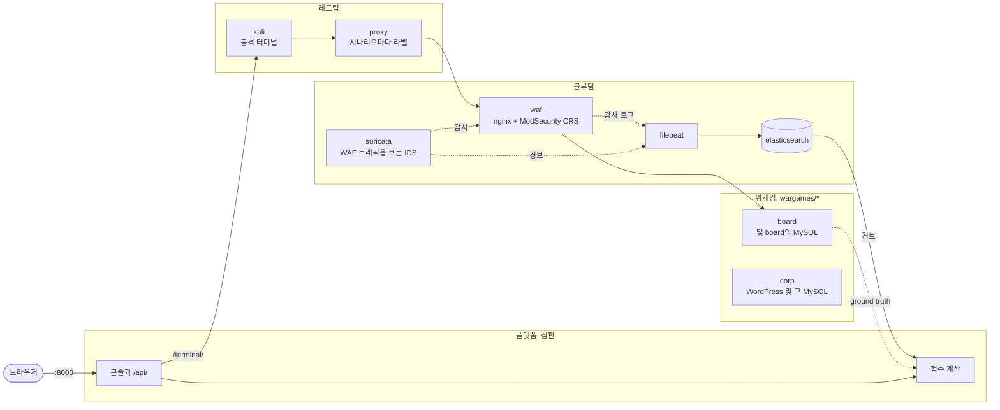

# fsl-project-mvp

사이버 공격·방어 훈련 레인지다. 레드팀은 WAF 뒤 MySQL 위에서 도는 두 대상 — Django 게시판과 WordPress 회사 사이트 — 을 공격하고, 블루팀은 Suricata와 ModSecurity로 방어하며, 플랫폼은 양쪽이 각각 무엇을 이뤘는지 점수를 매긴다. 이 저장소는 버리는 프로토타입이고, 실제 제품 프로젝트는 다른 곳에 있다.

- `CLAUDE.md`: 저장소의 목적, 점수 방식, 작업 규칙
- `docs/ARCHITECTURE.md`: 레인지의 구성 방식과 앞으로의 방향
- `docs/THREAT-MODEL.md`: 레인지가 모사하는 것과 빼 둔 것
- `docs/STATE.md`: 작업이 어디까지 왔는지
- `README.ko.md`, `docs/ARCHITECTURE.ko.md`: 이 README와 아키텍처의 한국어판

## 전체 구성

### 실행 환경

OpenStack 클라우드에서는 스택 전체가 VM 하나 안에서 돌고, 그 VM은 Heat 스택 하나(`deploy/openstack/platform.yaml`)가 만든다. 플랫폼은 member 역할 사용자 `fsl-range`로 OpenStack API를 통해 레인지를 읽는다. 점수를 매기는 레인지는 아직 VM 안의 Docker 레인지다(`docs/STATE.md`의 백로그 2번이 이를 OpenStack으로 옮긴다).



### 스택 내부

레드팀은 블루팀의 방어를 거쳐 워게임을 공격한다. 블루팀의 센서는 Elasticsearch에 기록을 남긴다. 플랫폼은 심판으로서 그 경보와, 공격자가 대상 시스템 자신의 데이터에 맞춰 증명한 loot로 점수를 매긴다. 플랫폼, 레드팀, 블루팀은 최상위 `compose.yaml`에 있다. 각 워게임은 최상위 `compose.yaml`이 include하는 `wargames/` 아래 폴더 하나이므로, 새 워게임은 새 폴더 하나와 `include:` 한 줄이면 된다. 워게임은 둘이다: `loot_verified` 대상인 게시판과, `effect_observed` 대상인 WordPress 사이트 corp.



선이 읽기 쉽도록 그래프에서 뺀 것이 있다. Kali의 raw TCP는 프록시를 거치지 않고 WAF로 바로 간다. 플랫폼은 스크립트 시나리오를 WAF에 직접 쏜다. 또 플랫폼은 기반 계층(여기서는 `docker exec`, OpenStack에서는 ssh)을 통해 센서의 룰과 프록시의 시나리오 라벨을 쓰고 공격자의 명령 로그를 읽으며, 각 타깃의 ground truth는 estate 네트워크로 WAF를 거치지 않고 직접 읽는다 — 게시판의 `auth_user` 테이블, 그리고 corp-db의 MySQL 바이너리 로그(`mysqlbinlog`). corp가 제출된 loot가 아니라 effect로 채점되는 방식이다. 네트워크 구성은 `docs/ARCHITECTURE.md`에 있다.

## 스택 띄우기

Docker가 있는 호스트에서 저장소를 clone하고, GeoIP 데이터베이스를 한 번 받고, 스택을 띄운다.

```bash
bin/fetch-geoip
docker compose up -d --build
```

Elasticsearch의 managed GeoIP 다운로더는 꺼져 있고, 대신 `config/ingest-geoip`(지속되는 bind mount)에서 `GeoLite2-City.mmdb`를 읽는다. `bin/fetch-geoip`가 이 파일을 거기에 한 번 넣어 둔다. 이 파일은 커밋하지 않으며, 컨테이너를 다시 만들어도 다시 받지 않고 그대로 살아남는다(클라우드의 Elasticsearch는 다운로드 CDN에 닿지 못한다). 플랫폼은 시작할 때 docker 소켓 그룹을 맞추고 Elasticsearch ingest pipeline(증거의 이벤트 시각을 정하고 출발지 주소의 지리적 위치를 추정한다)을 등록하므로, 따로 실행할 것은 없다. 명령줄에서 스크립트 시나리오를 실행하거나 `bin/verify`를 돌리려면(`--fast` 포함) virtualenv가 필요하다.

```bash
python3 -m venv .venv && .venv/bin/pip install -r platform/requirements.txt
```

| 포트 | | 사용처 |
|---|---|---|
| 8000 | 콘솔, `/api/`, `/terminal/`의 공격자 터미널 | 사람의 브라우저 |
| 8080 | 블루 콘솔 창에 띄우는 pfSense GUI 리버스 프록시 | 사람의 브라우저 |
| 9200 | Elasticsearch | 인수 테스트 |

사람에게 필요한 포트는 8000과 8080 둘이다. 플랫폼 이미지 안의 nginx가 8000을 받아 `/terminal/`을 Kali의 ttyd로 넘기고(ttyd는 자기 포트를 따로 공개하지 않는다), 블루 콘솔의 pfSense 창은 8080에서 리버스 프록시로 내보낸다(pfSense의 루트 절대 URL이 풀리도록 별개 오리진). Mac에서는 모든 포트를 `127.0.0.1`에만 공개한다. 플랫폼 VM에서는 8000과 8080을 VM 자기 주소에 공개한다(`.env`의 `FSL_PUBLISH`). 대상 시스템은 공개하지 않는다. 명령줄 시나리오와 인수 테스트는 콘솔과 마찬가지로 레인지 안에서 대상 시스템에 닿는다. 레인지 안에서 대상 시스템은 WAF 뒤 80번 포트에 둘 있다: `http://board.com`(`edge` 네트워크 별칭)과 `http://corp.com`(`Host` 헤더로 닿는 vhost).

### OpenStack에서

`deploy/openstack/platform.yaml`은 플랫폼 VM용 Heat 템플릿이다. 이 템플릿이 무엇을 만들고 첫 부팅 때 무엇을 하는지는 `docs/ARCHITECTURE.md`("Built: the platform VM")에 있다. 프로젝트 멤버로서, 프로젝트의 openrc를 source하고 `python-heatclient`를 설치한 상태에서 실행한다.

```bash
openstack stack create -t deploy/openstack/platform.yaml --parameter keystone=http://KEYSTONE:5000 fsl-platform
```

`keystone`은 `/v3`를 뺀 Keystone 기본 URL이고, `/v3`는 플랫폼이 붙인다. 사용자는 `default` 도메인에서 찾고, 프로젝트는 스택이 속한 프로젝트를 쓴다. 비밀번호는 절대 스택에 넣지 않는다. Nova는 인스턴스의 user data를 보관하고, 그 메타데이터 서비스는 VM에서 도는 모든 것에, 레인지의 컨테이너까지 포함해 이를 내준다. 스택의 `address`가 ssh에 응답하면, 비밀번호가 명령줄에 한 번도 나타나지 않도록 파일에서 읽어 추가하고 플랫폼을 다시 만든다.

```bash
{ printf 'FSL_OPENSTACK_PASSWORD='; cat PASSWORD_FILE; echo; } | ssh ubuntu@ADDRESS 'cloud-init status --wait >/dev/null && cat >> /opt/fsl/openstack.env && sudo docker compose -f /opt/fsl/compose.yaml up -d platform'
```

| 파라미터 | 기본값 | |
|---|---|---|
| `ref` | `dev` | clone할 브랜치나 태그 |
| `repository` | GitHub의 이 저장소 | |
| `user` | `fsl-range` | 플랫폼이 로그인하는 Keystone 사용자 |
| `key_name` | `fsl-claude` | `ssh ubuntu@ADDRESS`에 필요한 개인 키가 속한 키페어 |
| `image` | `ubuntu-24.04` | |
| `flavor` | `m1.windows` | |
| `external_network` | `provider` | |
| `cidr` | `10.20.0.0/24` | compose 서브넷이나 `172.17.0.0/16`과 겹치면 안 된다 |
| `dns` | `8.8.8.8,8.8.4.4` | |

스택의 `address` 출력값이 floating IP이고, 콘솔은 `http://ADDRESS:8000/`, 블루 콘솔의 pfSense 창은 `http://ADDRESS:8080/`에 있으며, 둘 다 아직 로그인은 없다. 9200과 5140은 VM의 loopback에 있다.

VM에서 checkout 위치는 `/opt/fsl`이고 소유자는 `ubuntu`다. compose, `bin/backup`, 아래의 복원 절차는 거기서 실행한다. 마지막 부팅 때 스택이 어떻게 올라왔는지는 `systemctl status fsl-platform`으로 본다.

비밀번호를 넣고 나면 플랫폼이 자기 API를 통해 레인지의 네트워크를 만든다.

```bash
curl -s -X POST -H "Content-Type: application/json" -d "{}" http://ADDRESS:8000/api/range/fabric/
```

같은 경로에 `GET`을 보내면 없는 것, 있는 것, 어긋난 것, 남아 있는 것을 보여 주고, `DELETE`는 네트워크를 내리지만 그 위에 서버가 서 있는 동안에는 거부된다.

레인지의 VM들은 플랫폼이 설정 스크립트로 만든 골든 이미지에서 부팅한다. 그 스크립트는 `declaration.yaml`이 `hosts:` 아래에 지정한다. POST 하나가 모든 빌드를 한 단계씩 진행하므로(빌더를 부팅하고, 설정이 보고하면 멈추고, 스냅샷을 찍고, 삭제한다), 답이 `"clean": true`라고 할 때까지 반복한다. 약 7분 걸린다.

```bash
curl -s -X POST -H "Content-Type: application/json" -d "{}" http://ADDRESS:8000/api/range/images/
```

빌드가 실패하면 `detail`에 그 콘솔의 끝부분을 보여 준다. 같은 경로에 `DELETE`를 보내면 실패한 빌더와 오래된 스크립트로 만든 이미지를 지운다.

이미지가 준비되면 POST 하나가 WAF와 게시판을 각각 자기 이미지에서 부팅하고, 플랫폼은 `mgmt`에서 ssh로 이들에 닿는다.

```bash
curl -s -X POST -H "Content-Type: application/json" -d "{}" http://ADDRESS:8000/api/range/slot/
```

그런 다음 edge와 WAF가 ssh로 설정을 받는다. pfSense의 WAN 주소, pass 룰, Suricata와 syslog, WAF의 ModSecurity 로그 전달이며, `POST /api/range/configure/`로 한다. 세션 사이에 slot을 초기화하려면 `POST /api/range/slot/rebuild/`가 모든 VM을 그 골든 이미지에서 Nova-rebuild하므로(포트와 주소는 유지), 수정된 데이터나 룰이 넘어오지 않는다. rebuild는 ssh로 밀어 넣은 설정을 지우므로, VM이 다시 올라오면 `configure/`를 다시 실행한다(게시판은 이미지에 구워져 있어 rebuild만으로 충분하다).

레인지는 스택 바깥에 산다. `openstack stack delete fsl-platform`이나 서버를 교체하는 스택 업데이트 전에, 순서대로 `/api/range/slot/`에 `DELETE`를 보내고 그다음 `/api/range/fabric/`에 보내 레인지를 내린다. 플랫폼의 ssh 키는 VM에 있어서 새 VM은 새 키를 만들고, fabric은 이전 키페어를 drift로 보고한다. 이미지는 남는다. 이미지가 느린 부분이다.

스택은 `key_name`이 가리키는 키페어로 부팅하므로, 그 키페어가 프로젝트에 먼저 있어야 한다.

```bash
openstack keypair create --public-key PUBLIC_KEY_FILE fsl-claude
```

### pfSense 이미지

pfSense CE는 클라우드 이미지도, 스크립트 설치도 없다. 설치 수단은 Netgate의 온라인 설치 프로그램 하나뿐이고(`netgate-installer-v1.2-RELEASE-amd64.iso`, $0 Netgate Store 결제로 받는다), 이것으로 CE를 설치하는 데는 계정이 필요 없다. 클라우드에 volume 서비스가 없어서, 설치는 Nova의 stable rescue를 통해 서버 자신의 root 디스크로 들어간다. stable rescue는 ISO를 CD-ROM으로 부팅하고 서버의 디스크를 붙인 채로 둔다. `fsl-range`로서 실행한다.

```bash
openstack image create netgate-installer --file netgate-installer.iso --disk-format iso --container-format bare --private --property hw_rescue_device=cdrom --property hw_rescue_bus=scsi --property hw_scsi_model=virtio-scsi
openstack network create fsl-pfsense-build-lan
openstack subnet create --network fsl-pfsense-build-lan --subnet-range 192.168.1.0/24 --no-dhcp --gateway none fsl-pfsense-build-lan
openstack server create --image cirros-0.6.3 --flavor m1.small --network fsl-platform --network fsl-pfsense-build-lan --wait fsl-pfsense-build
openstack server rescue --image netgate-installer fsl-pfsense-build
openstack console url show --novnc fsl-pfsense-build
```

그 콘솔에서: 안내를 수락하고, Install, WAN은 `vtnet0`(인터넷에 닿는 `fsl-platform` 포트)을 DHCP로, LAN은 `vtnet1`을 기본값으로, Install CE, `vtbd0`에 ZFS와 GPT, 현재 stable 버전, 그다음 Halt를 고른다. Reboot를 고르면 설치 프로그램이 다시 시작된다. 그다음 `openstack server unrescue fsl-pfsense-build`를 실행하고, pfSense가 메뉴까지 부팅하는지 확인하고, 옵션 6으로 멈춘 뒤 다음을 실행한다.

```bash
openstack server image create --name fsl-pfsense --wait fsl-pfsense-build
openstack image set --property hw_vif_model=virtio --property hw_disk_bus=virtio --property os_distro=freebsd fsl-pfsense
```

그 뒤 `fsl-pfsense-build`와 build LAN을 지운다. pfSense는 비디오 콘솔에 쓰므로 `openstack console log show`는 비어 있다. noVNC를 쓴다.

## 라운드 진행

http://localhost:8000 을 열고 세션을 시작한 뒤, 레드 콘솔과 블루 콘솔을 나란히 연다. 헤더의 표시 언어 버튼으로 영어와 한국어를 전환한다.

- **레드**에는 목표, Kali 셸, 스크립트 시나리오가 있다. 실행한 시나리오에는 나가는 길에 라벨이 붙는다. 또는 시나리오 이름을 정하고 시작을 누른 뒤 셸에서 작업하고 중지를 누를 수도 있다. 그 사이에 보낸 모든 것이 그 이름으로 묶인다.
- **블루**는 실제 도구를 프레임하는 사이드바다 — pfSense GUI(엣지 방화벽과 그 Suricata 룰), Kibana(풀 ELK), WAF 터미널. 제로섬 점수판은 세션이 닫힐 때 세션 페이지에 공개된다.

스크립트 시나리오는 인수 테스트처럼 명령줄에서도 실행할 수 있다. 대상 시스템은 공개하지 않으므로, 하니스는 콘솔이 실행하는 방식 그대로 레인지 안에서, 플랫폼에서 실행한다 — 기본은 게시판, corp는 자신의 vhost와 케이스 파일로.

```bash
docker compose exec platform \
  python redteam/run.py --target http://board.com --tool-target http://board.com
docker compose exec platform \
  python redteam/run.py --target http://corp.com --tool-target http://corp.com \
    --cases redteam/cases/corp.yaml
```

## 검증

```bash
bin/verify --fast     # unit and API tests and the metrics, no stack needed
bin/verify            # also the acceptance tests in test/, against the live stack
```

전체 실행은 플랫폼을 재시작하고 대상 시스템, 룰, 공격자의 출발지를 초기화하므로, 누군가 쓰고 있는 스택에는 돌려서는 안 된다. 세션은 그 실행이 직접 만든 것만 지운다. `bin/prune`은 세션을 수동으로 지우고, `--apply` 없이 실행하면 dry run이다.

```bash
bin/prune --keep 20 --apply      # keep the newest 20
bin/prune --ids FILE --apply     # only the closed sessions FILE lists
```

템플릿에 Tailwind 클래스를 추가한 뒤에는 `bin/build-css`를 실행한다. 콘솔이 인터넷 없이도 렌더링되도록 스타일시트는 생성해서 커밋해 두며, 스타일시트가 최신이 아니면 테스트가 실패한다.

## 백업과 복원

플랫폼의 데이터(세션, 시나리오, 탐지, 목표, 탐지정책, 억제)는 SQLite 파일 하나로, `fsl_platformdata` 볼륨의 `/data/db.sqlite3`다. 그 밖에는 아무것도 백업하지 않는다. Elasticsearch의 `fsl_esdata` 볼륨, `fsl_filebeatdata`에 있는 Filebeat의 registry, `fsl_waflogs`에 있는 ModSecurity의 감사 로그, `deploy/suricata/logs`에 있는 일반 파일인 Suricata의 `eve.json` 모두 백업 대상이 아니다. `docker compose down -v`는 볼륨 네 개를 지우고 그 파일은 남긴다.

```bash
bin/backup      # writes backups/db-<UTC time>.sqlite3 while the platform serves
```

SQLite의 온라인 백업 API를 쓰고, 복사본을 `PRAGMA integrity_check`로 검사하며, 어느 단계든 실패하면 아무것도 남기지 않는다. Docker 안에 있지 않은 플랫폼에 닿으려면, 플랫폼 설정을 import할 수 있는 상태로 `python -`을 실행하는 명령을 `FSL_PLATFORM_EXEC`에 지정한다.

복원은 플랫폼을 멈춘 상태에서 수동으로 한다.

```bash
docker compose stop platform
docker run --rm --network none --entrypoint sh --user fsl \
  -v fsl_platformdata:/data -v "$PWD/backups:/backups:ro" fsl-platform \
  -c 'rm -f /data/db.sqlite3-journal && cp /backups/db-20260925T020000Z.sqlite3 /data/db.sqlite3'
docker compose start platform
```

이미지의 entrypoint는 인자를 무시하고 서버를 시작하므로 `--entrypoint sh`가 이를 대신한다. 이미지 자체는 root로 돈다. `--user fsl`은 복사본을 플랫폼 사용자 소유로 만든다. `docker cp`를 쓰면 복사본이 root 소유로 남아 쓸 수 없다. 이전 `-journal`은 지워야 한다. 남아 있으면 SQLite가 복원한 파일 위에 이를 재생한다. 플랫폼은 시작할 때 백업 이후에 생긴 마이그레이션을 모두 적용한다. 복사 단계는 임시 볼륨에서 확인했고(`fsl` 소유로 들어간다), 절차 전체를 실행 중인 스택에서 돌려 보지는 않았다.

## 로컬 실습 전용

Elasticsearch는 보안 기능 없이, Django는 `DEBUG=1`로 돈다. Django는 `DJANGO_ALLOWED_HOSTS`가 더 지정하지 않는 한 `localhost`, `127.0.0.1`, `[::1]`에만 응답하고, 플랫폼 VM은 여기에 자기 floating IP를 더한다. 플랫폼에는 Docker 소켓이 마운트되어 있고, `/terminal/`의 Kali 셸은 인증 없는 root 셸이다. 둘 다 컨테이너 탈출 경로다.

플랫폼 VM에서도 마찬가지다. 게다가 거기서는 프로젝트의 비밀번호가 `/opt/fsl/openstack.env`와 플랫폼 컨테이너의 환경 변수에도 평문으로 들어 있다. VM의 ssh와 8000은 모든 주소에 열려 있고, 8000은 로그인을 묻지 않는다.
