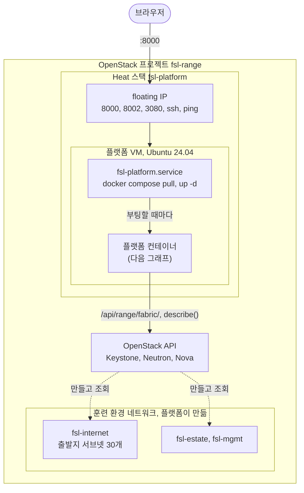
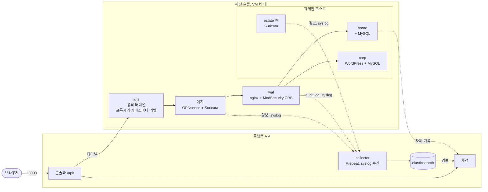

# fsl-project-mvp

사이버 공격·방어 훈련장입니다. 훈련 환경은 공격과 방어가 벌어지는 VM과
네트워크의 모음입니다. 레드팀은 웹사이트 두 개를 공격합니다. Django 게시판과
WordPress 회사 사이트이고, 각자 MySQL을 씁니다. 둘 앞에는 WAF가 있습니다.
블루팀은 Suricata와 ModSecurity로 방어하고, 플랫폼이 양쪽의 점수를 매깁니다.
이 저장소는 버릴 프로토타입입니다. 실제 제품 프로젝트는 다른 저장소에 있습니다.

Kolla-Ansible 2026.1로 구축하고 `nova_compute_virt_type: kvm`을 쓰는 OpenStack
위에서 돌아갑니다. Heat 스택 하나가 플랫폼 VM을 만듭니다. 플랫폼 VM은 플랫폼을
컨테이너로 실행합니다(`docker compose`, GHCR에 미리 빌드한 이미지). 그다음
플랫폼이 OpenStack API로 훈련 환경의 VM을 만듭니다. 이 과정 전체를 운영자
컴퓨터에서 `bin/cloud`가 실행합니다.

- `CLAUDE.md`: 저장소의 목적, 점수 계산 방식, 작업 규칙
- `docs/superpowers/specs/2026-10-08-composable-isolated-learning-mvp-design.md`:
  승인된 방향(2026-10-08). 일부는 아직 만들지 않았습니다.
- `docs/ARCHITECTURE.md`: 훈련 환경의 구성과 앞으로의 방향
- `docs/THREAT-MODEL.md`: 훈련 환경이 흉내 내는 것과 뺀 것
- `docs/STATE.md`: 작업 현황
- `docs/OPENSTACK.md`: 클라우드(Kolla-Ansible 2026.1)에 필요한 것, 프로젝트와
  플랫폼 VM, 훈련 환경, VM 한 대로 해 보는 체험
- `README.ko.md`, `docs/ARCHITECTURE.ko.md`: 이 README와 아키텍처 문서의 한국어판

## 필요한 것

운영자 컴퓨터, 즉 `bin/cloud`를 실행하는 곳:

- `git`, `ssh`, `ssh-keygen`, Python 3.10 이상이 있는 컴퓨터. 플랫폼이 쓰는
  Django 5.2가 Python 3.10 이상을 요구합니다.
- `python-openstackclient`와 `python-heatclient`. `.venv`에 설치합니다(3단계).
  Python venv 모듈이 필요합니다(Debian과 Ubuntu에서는 `python3-venv`:
  `sudo apt install python3-venv`).
- 클라우드 API와 플랫폼 VM의 floating IP에 닿는 네트워크 경로.
- github.com과 ghcr.io에 접속할 수 있는 인터넷. `bin/cloud`는 무엇이든 삭제하기
  전에 이미지를 pull할 수 있는지 확인합니다.

클라우드:

- x86_64 호스트에 Kolla-Ansible 2026.1로 구축하고 `nova_compute_virt_type: kvm`을
  쓰는 OpenStack. Heat는 기본으로 켜져 있습니다. Cinder, Octavia, Designate는
  필요 없습니다.
- floating IP 풀이 있는 외부 네트워크, 그리고 그 네트워크로 나가는 VM의 인터넷
  접속(`docs/OPENSTACK.md` §2.5, §2.6).
- 플랫폼 VM과 슬롯 하나를 올릴 자원. 슬롯은 훈련 환경 한 벌입니다. 합해서 vCPU 10,
  RAM 24 GB, 인스턴스 5, floating IP 1, 컴퓨트 노드 디스크 180 GB가 필요합니다.
  - Nova 기본 quota(코어 20, RAM 51200 MB, 인스턴스 10)로 충분합니다. Nova에는
    디스크 quota가 없으므로 180 GB는 quota가 아니라 컴퓨트 노드에 실제로 있어야
    하는 디스크 용량입니다.
  - 플랫폼 VM은 2 vCPU, 8 GB, 60 GB입니다. 슬롯의 VM 네 대는 각각 2 vCPU, 4 GB,
    30 GB입니다.
  - 슬롯(`compute.slots`)이 하나 늘 때마다 vCPU 8, RAM 16 GB, 디스크 120 GB,
    인스턴스 4가 더 듭니다. 이때는 quota를 올려야 합니다.

먼저 한 대에서 확인하려면 `docs/OPENSTACK.md` §9를 보세요. VirtualBox나 VMware의
VM 한 대에 클라우드 전체를 올리는 방법이 있습니다.

## 기동

1. **클라우드를 준비합니다(관리자, 한 번).** 외부 네트워크, 프로젝트 `fsl-range`와
   member 사용자 `fsl-range`, flavor `m1.large`와 `m1.medium`, 베이스 이미지
   `ubuntu-24.04`를 만듭니다. 명령은 `docs/OPENSTACK.md` §2.5, §3.1, §3.3, §3.6에
   있습니다. 관리자로 이미지를 올릴 때는 `--public`을 붙이세요. 붙이지 않으면
   `fsl-range`가 이미지를 보지 못합니다.
2. **clone합니다.**

   ```bash
   git clone https://github.com/Nekonic/fsl-project-mvp.git && cd fsl-project-mvp
   ```

3. **virtualenv를 만들고 OpenStack CLI를 설치합니다.** 이후 명령은 모두
   `.venv/bin/`을 거치므로 activate하지 않아도 됩니다.

   ```bash
   python3 -m venv .venv
   .venv/bin/pip install -r platform/requirements.txt python-openstackclient python-heatclient
   ```

4. **운영자 키를 만듭니다.** 플랫폼 VM에 로그인할 때 쓰는 ssh 키입니다. 훈련 환경
   키는 따로 만들 필요가 없습니다. 플랫폼이 훈련 환경 VM에 로그인할 때 쓰는 키이며,
   `~/.ssh/fsl-platform`이 없으면 처음 `bin/cloud up`을 실행할 때 만들어집니다.

   ```bash
   ssh-keygen -t ed25519 -N "" -f ~/.ssh/fsl_claude
   ```

5. **`deploy/openstack/cloud.yaml`을 작성합니다.** 예제를 복사합니다. 복사본은
   git이 무시합니다. 자기 값만 바꿉니다.

   ```bash
   cp deploy/openstack/cloud.example.yaml deploy/openstack/cloud.yaml
   mkdir -p ~/.config/fsl && (umask 077; touch ~/.config/fsl/fsl-range.password)
   ```

   `~/.config/fsl/fsl-range.password`에 `fsl-range` 사용자의 비밀번호를 한 줄로
   적습니다. 그다음 `cloud.yaml`에서 키 두 개를 바꿉니다.

   - `identity.keystone`: `/v3`를 뺀 Keystone URL. 예제 값은 메인테이너의 랩
     주소입니다.
   - `network.external`: 1단계에서 만든 외부 네트워크의 이름.

   나머지 키는 그대로 둡니다. 위 단계에 맞춰 이미 채워져 있습니다. 모든 키의
   설명은 `docs/OPENSTACK.md` §4에 있습니다. 값이 잘못되면 로더가 아무것도
   바꾸기 전에 거부하고 해당 키를 알려 줍니다.

6. **Nova 키페어를 만듭니다.** 운영자 키의 공개키로, `fsl-range` 사용자 권한으로
   만듭니다.

   ```bash
   export OS_AUTH_URL=<identity.keystone>/v3 OS_IDENTITY_API_VERSION=3 OS_INTERFACE=public \
     OS_REGION_NAME=RegionOne OS_USER_DOMAIN_ID=default OS_PROJECT_DOMAIN_ID=default \
     OS_PROJECT_NAME=fsl-range OS_USERNAME=fsl-range \
     OS_PASSWORD="$(cat ~/.config/fsl/fsl-range.password)"
   .venv/bin/openstack keypair create --public-key ~/.ssh/fsl_claude.pub fsl-claude
   ```

   `<identity.keystone>`에는 `cloud.yaml`의 그 값을 넣습니다(예:
   `http://192.168.100.10:5000`). region, interface, domain도 `cloud.yaml`에 적은
   값을 씁니다.

7. **전체를 올립니다.**

   ```bash
   .venv/bin/python bin/cloud up
   ```

   `bin/cloud up`은 플랫폼 VM을 만들고, 이어서 플랫폼 자신의 API로 훈련 환경을
   만들면서 단계마다 출력합니다. 처음 실행할 때는 훈련 환경의 골든 이미지(훈련
   환경 VM이 부팅할 때 쓰는 VM 이미지)와 OPNsense 에지 이미지를 클라우드에서
   빌드하므로, 이후 실행보다 훨씬 오래 걸립니다. `docs/OPENSTACK.md` §9의
   시험에서는 빈 클라우드에서 17분 41초가 걸렸습니다(빌더 네 대를 병렬로
   실행). 끝나면
   `the range is ready; the platform is at http://ADDRESS:8000/`를 출력합니다.

8. **동작을 확인합니다.** 브라우저로 그 주소를 엽니다.

   - 홈 화면에 board 워게임이 보입니다. **레슨**에서 **레슨 1**의 **시작**을
     누릅니다.
   - 세션 화면은 몇 초 안에 열립니다. **블루팀 콘솔** 카드의 **열기**를 누릅니다.
     콘솔에 회사 네트워크를 그린 **구성도** 창이 보이고, 그 옆의 레슨 노트에 첫
     단계가 적혀 있습니다.
   - 훈련 네트워크가 아직 준비되지 않았다는 안내가 나오면 기다립니다. 닫힌
     세션의 슬롯은 2분쯤 뒤에 초기화됩니다.

   터미널에서는 `curl -s http://ADDRESS:8000/api/range/ready/`가 레슨을 시작하기
   전에 `"ready": true`를 돌려줍니다. 세션이 열려 있는 동안은 `false`이고,
   세션이 닫히고 슬롯이 초기화되면 다시 `true`입니다.

9. **실패하면.** `bin/cloud up`은 처음 실패한 곳에서 멈추고 이유를 알려 줍니다.
   `cloud.yaml`의 키, 없는 flavor나 이미지, public이 아닌 GHCR 패키지가 이름으로
   나옵니다. 원인을 고친 뒤 같은 명령을 다시 실행하면 멈춘 곳부터 이어 갑니다.

   - 플랫폼 VM: `ssh -i ~/.ssh/fsl_claude ubuntu@ADDRESS`로 로그인해
     `systemctl status fsl-platform`(마지막 부팅의 기동 결과),
     `sudo cloud-init status --long`, `sudo docker logs fsl-platform`을 봅니다.
   - Heat 스택: 6단계의 셸에서
     `.venv/bin/openstack stack failures list fsl-platform`을 실행합니다.
   - 스택은 만들어졌는데 VM에서 `fsl-platform`이 한 번도 실행되지 않은 경우.
     `sudo docker ps`에 `fsl-platform` 컨테이너가 없고,
     `sudo cloud-init status --long`에 이유가 나옵니다. VM이 인터넷에 나가지
     못하는 경우가 많습니다(`docs/OPENSTACK.md` §2.6). 첫 부팅이 느릴 뿐이라면
     `bin/cloud up`을 다시 실행하면 마무리됩니다. 그렇지 않으면 원인을 고치고
     `.venv/bin/python bin/cloud up --replace`를 실행합니다. 그 VM에는 저장된
     것이 없으므로 백업 없이 교체됩니다.
   - 새 플랫폼 VM이 이전 VM에서 DB를 받지 못할 때가 있습니다. 위 경우나 `down`
     뒤가 그렇습니다. 이때 `bin/cloud up`은 `backups/db-<UTC 시각>.sqlite3` 중
     행이 있는 가장 최근 백업을 복원하고 파일 이름을 출력합니다. 그런 백업이
     없으면 빈 DB로 시작하고 그렇다고 알려 줍니다.
   - 처음부터 다시 하려면 `.venv/bin/python bin/cloud down`을 실행한 뒤
     `bin/cloud up`을 다시 실행합니다. `down`은 훈련 환경과 스택(실패한 스택
     포함)을 지웁니다. Glance 이미지, 키페어, 훈련 환경 키는 남깁니다. 플랫폼
     VM에 DB가 있으면 먼저 백업합니다. 백업할 수 없으면 아무것도 지우지 않고
     거부합니다. 플랫폼 컨테이너가 멈춰 있으면 `down`이 먼저 시작합니다. VM의
     ssh나 Docker가 응답하지 않거나 컨테이너가 시작되지 않으면 거부합니다. 먼저
     ssh(운영자 키, 보안 그룹, 경로)를 고치세요.

## 전체 구성

### 실행 위치

플랫폼과 그 주변 서비스는 VM 한 대에서 돌아갑니다. 이 VM은 Heat 스택 하나
(`deploy/openstack/platform.yaml`)가 만듭니다. 플랫폼은 member 역할 사용자
`fsl-range`로 OpenStack API를 호출해 훈련 환경을 다룹니다. 플랫폼 VM에는
`FSL_SUBSTRATE=range.openstack.connect`가 설정되어 있어, 플랫폼이 OpenStack에
훈련 환경을 만들고 다룹니다. `/api/range/ready/`가 슬롯이 준비됐다고 보고하기
전에는 세션을 시작할 수 없습니다.

cloud-init이 `fsl-platform.service`를 설치합니다. 이 서비스는 부팅할 때마다
`/opt/fsl/compose.yaml`로 `docker compose pull`과 `docker compose up -d`를
실행합니다.

- 이미지는 일곱 개를 직접 빌드합니다: platform, board, corp, corp-db, kali,
  proxy, gns3. `dev`에 push할 때마다 `.github/workflows/images.yml`이 빌드해
  `ghcr.io/nekonic/fsl-<name>`으로 게시합니다. 태그는 커밋 SHA와 `dev`입니다.
- VM은 clone한 커밋의 SHA를 `FSL_IMAGE_TAG`로 `/opt/fsl/.env`에 적습니다. 그래서
  정확히 그 커밋의 이미지로 실행합니다.
- GitHub는 저장소가 public이어도 첫 push 때 만드는 패키지를 private으로 둡니다.
  일곱 개를 한 번씩 public으로 바꾸세요. 그렇지 않으면 로그인 없는 pull이
  실패합니다. github.com에서 패키지 페이지, **Package settings**, **Change
  visibility**, **Public** 순서로 들어갑니다. 되돌릴 수 없습니다.
- VM의 컨테이너는 `fsl-platform`, `fsl-elasticsearch`, `fsl-kibana`, `fsl-gns3`,
  `fsl-collector`입니다. 로그는 ssh로 로그인해 `sudo docker logs fsl-platform`
  (또는 다른 컨테이너 이름)으로 봅니다.
- 아직 push하지 않은 커밋을 실행하려면 `--sideload`를 쓰세요(`docs/OPENSTACK.md`
  §5.3).

Elasticsearch의 managed GeoIP downloader는 꺼 두었습니다. 대신
`config/ingest-geoip`에서 `GeoLite2-City.mmdb`를 읽습니다. 이 디렉터리는
bind mount라서 컨테이너를 다시 만들어도 남습니다. 클라우드의 Elasticsearch가
다운로드 CDN에 접속할 수 없으므로, cloud-init이 `bin/fetch-geoip`로 이 파일을
채웁니다. 이 파일은 커밋하지 않습니다.

플랫폼은 시작할 때 먼저 docker 소켓 그룹을 설정합니다. 서비스를 시작하는 동안
백그라운드에서 세 가지를 합니다.

- Elasticsearch ingest pipeline을 등록합니다. 이 pipeline은 이벤트마다 시각을
  정하고 출발지 주소의 위치를 찾아 붙입니다.
- Kibana의 data view, "Alerts" 검색, "Overview" 대시보드를 가져옵니다.
- Kibana의 기본 경로를 그 검색으로 지정합니다.

이 객체들은 Kibana의 기본 space에 있습니다. 5601번 포트로만 접근할 수 있습니다.

세션을 열면 그 세션만의 Kibana space "SOC"가 만들어집니다(`compose.yaml`이
설정하는 `KIBANA_URL`). space id는 `soc-`에 세션의 인덱스 패턴을 붙인
`soc-logs-<slot>`입니다. space에는 data view "logs-*"와 "Events" 검색이 있습니다.
여기서는 엔진과 센서의 구성도 이름이 필드로 보이고, 플랫폼 내부 필드는
숨겨집니다.

플랫폼은 훈련 환경 네트워크를 세 종류 만듭니다. `fsl-internet`은 모의 인터넷이고
출발지 서브넷이 30개 있습니다. `fsl-estate`는 대상 시스템이 있는 회사 내부망입니다.
`fsl-mgmt`는 관리망이고, 플랫폼이 훈련 환경 VM에 접속할 때 씁니다.


```mermaid
flowchart TB
  person(["브라우저"])

  subgraph cloud["OpenStack 프로젝트 fsl-range"]
    api["OpenStack API<br/>Keystone, Neutron, Nova"]
    subgraph heat["Heat 스택 fsl-platform"]
      fip["floating IP<br/>8000, 8002, 3080, ssh, ping"]
      subgraph vm["플랫폼 VM, Ubuntu 24.04"]
        unit["fsl-platform.service<br/>docker compose pull, up -d"]
        stack["플랫폼 컨테이너<br/>(다음 그래프)"]
      end
    end
    subgraph fabric_box["훈련 환경 네트워크, 플랫폼이 만듦"]
      internet["fsl-internet<br/>출발지 서브넷 30개"]
      inside["fsl-estate, fsl-mgmt"]
    end
  end

  person -->|":8000"| fip
  fip --> vm
  unit -->|"부팅할 때마다"| stack
  stack -->|"/api/range/fabric/, describe()"| api
  api -.->|만들고 조회| internet
  api -.->|만들고 조회| inside
```

### 세션의 구성

레드팀은 블루팀의 WAF와 IDS를 거쳐 워게임을 공격합니다. 센서의 경보는
Elasticsearch로 갑니다. 플랫폼은 이 경보와 대상 시스템 자신의 기록으로 점수를
매깁니다. 첫 번째 점수는 레드팀이 가져간 목표입니다. 두 번째 점수는 방어가 맞게
또는 틀리게 판단한 건수(TP, FP, FN, TN)입니다. 공격이 성공했는지는 플랫폼이 아니라
대상 시스템 자신의 데이터가 정합니다. 게시판은 공격자가 제출한 해시를 세션을 열 때
떠 둔 게시판 계정 사본과 플랫폼이 대조합니다. corp는 corp DB의 변경 로그를
플랫폼이 읽습니다.

`compose.yaml`에는 플랫폼 VM에서 계속 떠 있는 서비스가 들어 있습니다. 플랫폼,
Elasticsearch, Kibana, `gns3`(학습자용 구성도), `collector`입니다. `collector`는
훈련 환경의 syslog만 받는 Filebeat입니다.

세션 하나의 서비스는 그 세션 슬롯의 VM 네 대에서 돕니다. OPNsense 에지(방화벽과
Suricata), WAF, Kali(마커를 붙이는 프록시와 고객 트래픽), 워게임 호스트(워게임
컨테이너 전부와 estate 쪽 Suricata)입니다. 로그는 syslog로 `collector`에 보냅니다.

닫힌 세션은 `FSL_RETAIN_CLOSED_MINUTES`분(기본 60, `compose.yaml`에서 설정) 동안
DB에 남습니다. 그 시간이면 점수와 결과 보고를 읽을 수 있습니다. 그 뒤에는 플랫폼이
세션을 케이스, 탐지 기록, 고객 요청, 목표와 함께 삭제합니다. 시작할 때와 세션이
닫힐 때마다 확인합니다. 열린 세션은 삭제하지 않습니다.

워게임을 추가하려면 다음이 필요합니다.

- `wargames/` 아래에 `compose.yaml`, `scenario.yaml`, `objectives.yaml`이 든 폴더
- `redteam/cases/` 아래의 케이스 파일
- `platform/range/declaration.yaml`의 `fsl-wargame-host` 항목에서 `wargames:` 아래에
  넣는 워게임 이름과 `publish:` 아래에 넣는 포트, 그리고
  `deploy/waf/board.com.conf`의 `server` 블록

`platform/wargames.py`가 `scenario.yaml`을 보고 워게임을 찾습니다. 워게임은 두
개입니다. 게시판은 Django이고 `loot_verified`로 채점합니다. 제출한 해시를
게시판 계정의 스냅샷과 대조합니다. corp는 WordPress이고 `effect_observed`로
채점합니다. corp DB의 변경 로그를 봅니다.


```mermaid
flowchart LR
  person(["브라우저"])

  subgraph platformvm["플랫폼 VM"]
    console["콘솔과 /api/"]
    scoring["채점"]
    collector["collector<br/>Filebeat, syslog 수신"]
    es[("elasticsearch")]
  end

  subgraph slot["세션 슬롯, VM 네 대"]
    kali["kali<br/>공격 터미널<br/>프록시가 케이스마다 라벨"]
    edge["에지<br/>OPNsense + Suricata"]
    waf["waf<br/>nginx + ModSecurity CRS"]
    subgraph host["워게임 호스트"]
      board["board<br/>+ MySQL"]
      corp["corp<br/>WordPress + MySQL"]
      estate["estate 쪽<br/>Suricata"]
    end
  end

  person -->|":8000"| console
  console -->|"터미널"| kali
  kali --> edge
  edge --> waf
  waf --> board
  waf --> corp
  edge -.->|"경보, syslog"| collector
  waf -.->|"audit log, syslog"| collector
  estate -.->|"경보, syslog"| collector
  collector --> es
  es -->|경보| scoring
  board -.->|자체 기록| scoring
  console --> scoring
```

그래프에 없는 것:

- Kali의 raw TCP는 프록시를 거치지 않고 에지를 지나 WAF로 갑니다.
- 스크립트 케이스는 공격자 박스에서 출발합니다. 플랫폼이 ssh로 Kali에서 `curl`이나
  도구를 실행하며, 고른 출발지 주소를 씁니다.
- 플랫폼은 센서의 룰과 프록시의 케이스 라벨을 쓰고, 공격자의 명령 로그와
  corp-db의 MySQL 바이너리 로그(`mysqlbinlog`)를 읽습니다. 이것은 ssh로 합니다.
- 플랫폼은 게시판의 자체 기록(`auth_user` 테이블)을 WAF를 거치지 않고 게시판에서
  HTTP로 바로 읽습니다(`BOARD_API_URL`).

Kali 터미널은 레드팀 콘솔에 있고, 레슨과 시나리오에서는 블루팀 콘솔의 Kali 창에도
있습니다. 플랫폼 안의 ttyd가 세션 슬롯에 있는 Kali VM의 `mgmt`
주소로 ssh 접속합니다(`/vm-terminal/kali/?arg=<세션 id>`). 프롬프트는 Kali
자체와 같은 `(kali㉿kali)`입니다. WAF의 프롬프트는 `ubuntu@waf`입니다. 네트워크
구성은 `docs/ARCHITECTURE.ko.md`에 있습니다.

## OpenStack 운영

위의 단계는 짧은 경로입니다. 이 절은 각 부분을 설명합니다.

클라우드마다 다른 값은 모두 파일 하나, `deploy/openstack/cloud.yaml`에 있습니다.
git이 무시하는 파일이고, `deploy/openstack/cloud.example.yaml`을 복사해 만듭니다.
이 파일에는 다음이 들어 있습니다.

- Keystone URL, region, interface, domain, 프로젝트와 member 사용자
- 비밀번호를 읽을 위치: `password_file` 또는 `password_env`. 비밀번호 자체는
  파일에 넣지 않습니다.
- 외부 네트워크, DNS, 테넌트 MTU, platform·estate·mgmt CIDR
- 베이스 이미지 이름, availability zone
- 플랫폼, 이미지 빌더, 훈련 환경, 역할별(`edge`) flavor
- 운영자의 키페어와 키 파일, 훈련 환경 키
- 빌드할 OPNsense 릴리스: 버전, 미러, 릴리스 공지에 있는 이미지 SHA256과 서명 키
  SHA256
- 스택, 저장소, ref

모든 스크립트와 Heat 스택이 이 파일을 읽습니다. 해석할 수 없는 값이 있으면
아무것도 건드리기 전에 거부하고, 잘못된 키를 모두 알려 줍니다.

클라우드에 올려 둘 이미지는 딱 하나입니다. Canonical의 기본 Ubuntu 24.04 클라우드
이미지를 수정 없이 `compute.base_image`에 적은 이름으로 업로드합니다. 내려받기,
체크섬, `openstack image create` 명령은 `docs/OPENSTACK.md`에 있습니다. 나머지는
모두 이 이미지에서 만듭니다.

- 플랫폼 VM은 cloud-init이 부팅할 때 만듭니다.
- 훈련 환경의 골든 이미지는 빌더가 만듭니다.
- OPNsense 에지 이미지는 공식 릴리스를 내려받는 빌더가 만듭니다(아래).

`.venv`에 OpenStack CLI가 있는 상태(3단계)에서 운영자 컴퓨터에서 실행합니다.

```bash
.venv/bin/python bin/cloud up        # 플랫폼 VM, 그다음 훈련 환경 전체
.venv/bin/python bin/cloud down      # DB 백업, 키 보관, 훈련 환경과 스택 제거
```

`up`은 다음을 순서대로 합니다.

1. 플랫폼의 Heat 스택(`deploy/openstack/platform.yaml`)이 없으면 만듭니다.
   `--replace`를 주면 이미 있는 스택을 `bin/platform-rebuild`로 교체합니다.
2. API가 응답할 때까지 기다립니다.
3. 플랫폼 자신의 훈련 환경 API를 순서대로 호출합니다. fabric(네트워크, 키페어,
   보안 그룹), images(clean이 될 때까지 반복), slot, configure 순서입니다.
4. `/api/range/ready/`가 ready라고 할 때까지 기다립니다.

처음 만난 drift, 실패한 이미지, 막힌 슬롯, 거부된 configure에서 멈추고 이유를
알려 줍니다.

`up`과 `down` 모두 테스트 클라우드에서 실행해 봤습니다. 2026-10-20에는
`up --replace --sideload`, 컨테이너가 멈춘 채 인계를 받지 못한 플랫폼에 대한 일반
`up`, `down`, 그리고 `down` 뒤의 `up`(행이 있는 가장 최근 백업을 복원)을 실제로
돌렸습니다(`docs/DECISIONS.md` 2026-10-20, "Live checks of the bring-up paths").
같은 날 수정 두 건을 더 넣은 뒤에는 컨테이너가 멈춘 플랫폼에 대한 `down`, 비밀번호
줄이 없는 플랫폼에 대한 `up`, 처음 만든 훈련 환경 키, 워게임 호스트 이미지를 다시
빌드하지 않는 `down` 뒤의 `up`도 돌렸습니다. VM 한 대에 빈 클라우드를 올려 §9 전체도
돌렸습니다(`docs/DECISIONS.md` 2026-10-20, "The one-VM trial and the last bring-up fixes").
단계는 `docs/OPENSTACK.md` §5에 있습니다.

`bin/platform-rebuild`만 실행하면 플랫폼 VM만 만들거나 교체합니다.

```bash
.venv/bin/python bin/platform-rebuild            # --cloud PATH, --ref REF
```

무엇이든 삭제하기 전에 ref의 커밋에 해당하는 이미지 일곱 개를 ghcr.io에서 로그인
없이 pull할 수 있는지 확인합니다. 훈련 환경 키(아래)를 보관하고, DB를
백업합니다(ssh로 `bin/backup` 실행). 그다음 스택을 삭제하고 `cloud.yaml`의 모든
파라미터로 다시 만든 뒤, `/api/sessions/`가 응답할 때까지 기다립니다.
`cloud.yaml`의 `backups.keep`(기본 1)은 `bin/platform-rebuild`와 `bin/cloud down`이
`backups/`에 남기는 DB 백업 개수입니다.

새 VM은 `ref`를 clone하고, 그 커밋으로 태그된 이미지를 pull해 시작합니다.
cloud-init이 클라우드 값을 `/opt/fsl/openstack.env`에 씁니다. 비밀 두 가지는
스택에 넣지 않습니다. 비밀번호와 플랫폼의 훈련 환경 ssh 키입니다. Nova 메타데이터
서비스는 컨테이너를 포함해 VM의 모든 프로세스에 user data를 내주므로, 스택에 넣은
비밀은 VM 안 어디서든 읽힙니다. VM이 ssh에 응답하고 cloud-init이 끝나면
`bin/platform-rebuild`가 다음을 합니다.

1. `FSL_OPENSTACK_PASSWORD`를 `/opt/fsl/openstack.env`에 덧붙입니다.
2. 훈련 환경 키를 플랫폼 데이터 볼륨의 `/data/ssh/id_ed25519`에 씁니다.
3. 백업해 둔 DB를 복원합니다. 이전 VM에 DB가 없었으면 `backups/`에서 행이 있는
   가장 최근 백업을 복원합니다.
4. 플랫폼 컨테이너를 다시 만듭니다.

훈련 환경 키는 운영자 컴퓨터의 `keys.range`(모드 0600) 파일입니다. 이 파일이
없을 때는 이렇게 합니다.

- 스택이 없거나 스택의 VM에 DB가 없으면 `bin/platform-rebuild`가 새로
  만듭니다(`ssh-keygen`, ed25519).
- DB가 있는 VM을 교체하면 실행 중인 플랫폼에서 한 번 복사해 옵니다.
- 실패한 스택을 교체할 때는 거부합니다.

키가 남아 있으므로 훈련 환경의 VM과 `fsl-platform` 키페어는 새 플랫폼을 계속
신뢰합니다. 플랫폼을 교체하는 동안에도 훈련 환경은 그대로 둘 수 있습니다.

아직 push하지 않은 커밋을 실행하려면 두 명령 모두 `--sideload NAME=TARBALL`
(여러 번 지정 가능)을 받습니다. TARBALL은 이 체크아웃에서 빌드한 이미지 하나를
`docker save`로 저장한 tarball입니다. VM은 여전히 `ref`를 clone하고 그 커밋의
이미지를 모두 pull합니다. 그다음 재구축 과정에서 다음을 합니다.

- git bundle로 이 체크아웃의 HEAD를 checkout합니다.
- tarball마다 `docker load`하고, 그 이미지에 clone한 커밋의 태그를 붙입니다.
  compose와 훈련 환경의 이미지 빌더가 이 태그를 씁니다.
- 모든 서비스를 다시 만듭니다(`--force-recreate`). 그래서 bind mount한 파일도
  HEAD의 것이 됩니다.

무엇이든 삭제하기 전에 두 가지를 거부합니다. `ghcr.io/nekonic/fsl-NAME:<commit>`
하나만 담고 있지 않은 tarball, 그리고 이미지가 나온 커밋과 HEAD 사이에 빌드
컨텍스트(`.github/workflows/images.yml`)가 달라진 이미지입니다. sideload한 VM이
재부팅하면 clone한 커밋의 이미지를 GHCR에서 pull해 sideload한 이미지를 덮어쓸 수
있습니다. 재부팅하지 말고 push한 뒤 재구축하세요.

스택의 `address` 출력값이 floating IP입니다. 콘솔은 `http://ADDRESS:8000/`에 있고
로그인을 요구하지 않습니다. 9200과 5601은 VM의 loopback에서만 열려 있습니다.
5140/udp는 VM의 모든 주소에서 수신합니다.

VM에서 체크아웃 위치는 `/opt/fsl`이고 소유자는 `ubuntu`입니다. compose,
`bin/backup`, 아래의 복원 절차는 이 디렉터리에서 실행하세요. 마지막 부팅의 기동
결과는 `systemctl status fsl-platform`으로 확인합니다.

`bin/cloud up`이 실행하는 훈련 환경 단계는 직접 호출할 수도 있습니다. 먼저
fabric입니다.

```bash
curl -s -X POST -H "Content-Type: application/json" -d "{}" http://ADDRESS:8000/api/range/fabric/
```

`GET`은 없는 것, 있는 것, 선언과 달라진 것(drift), 남은 것을 보여 줍니다.
`DELETE`는 fabric을 내립니다. 서버가 연결되어 있으면 거부됩니다.

훈련 환경의 VM은 골든 이미지로 부팅합니다. 플랫폼은 `declaration.yaml`이 `hosts:`
아래에 지정한 설정 스크립트로 이미지를 만들고, 스크립트마다 베이스 이미지로 부팅한
빌더 VM에서 실행합니다. POST 한 번에 모든 빌드가 한 단계씩 진행됩니다. 빌더 부팅,
설정이 끝났다고 보고하면 중지, 스냅샷, 삭제 순서입니다. 에지 빌더는 스냅샷하지 않습니다. 빌더가
디스크를 내놓으면 플랫폼이 받아서 Glance에 올립니다. 응답에 `"clean": true`가 나올 때까지 POST를
반복하세요.

```bash
curl -s -X POST -H "Content-Type: application/json" -d "{}" http://ADDRESS:8000/api/range/images/
```

빌드가 실패하면 `detail`에 빌더 콘솔 출력의 끝부분이 나옵니다. 같은 경로에
`DELETE`를 보내면 실패한 빌더와 예전 스크립트로 만든 이미지를 삭제합니다.

이미지가 준비되면 POST 한 번으로 VM 네 대를 각자의 이미지로 부팅합니다.
`fsl-edge`, `fsl-kali`, `fsl-waf`, `fsl-wargame-host`입니다. 워게임 호스트는 모든
워게임을 GHCR 컨테이너로 실행합니다. 플랫폼은 `mgmt`에서 ssh로 이 네 대에
접속합니다.

```bash
curl -s -X POST -H "Content-Type: application/json" -d "{}" http://ADDRESS:8000/api/range/slot/
```

그다음 `POST /api/range/configure/`가 ssh로 설정을 적용합니다. OPNsense 에지에는
config.xml(WAN 주소, pass 규칙, Suricata, syslog)을 넣고 재부팅합니다. WAF에는
ModSecurity 로그 전달을 설정합니다. board와 corp는 워게임 호스트에서 컨테이너로
실행되고, configure가 이들을 시작합니다.

`POST /api/range/slot/rebuild/`는 모든 VM을 골든 이미지로 Nova rebuild합니다.
포트와 주소는 유지됩니다. 수정한 데이터와 룰은 이어지지 않고, 적용한 설정도
지워집니다. `slot/rebuild/`만 따로 호출했다면 `configure/`를 직접 실행하세요.

세션을 닫으면 그 세션의 슬롯을 초기화합니다.

- Kali와 WAF는 다시 만듭니다.
- 에지는 그 자리에서 초기화합니다. 해시를 비교해서 파일이 달라졌을 때만
  재부팅합니다.
- 워게임 호스트도 그 자리에서 초기화합니다(`docker compose down -v`).

VM이 ACTIVE가 되면 플랫폼이 스스로 다시 configure합니다. 그동안
`GET /api/range/ready/`는 phase `RESETTING`을 보여 주고, 세션 열기는 거부됩니다.
초기화가 실패하면 이유와 함께 `RESET_FAILED`를 보여 주고,
`POST /api/range/configure/`로 다시 시도합니다.

`cloud.yaml`의 `compute.slots`(기본 1)는 훈련 환경을 몇 벌 세울지 정합니다. 벌마다
에지, WAF, Kali, 워게임 호스트를 따로 두고, internet·estate 네트워크도 벌마다
따로 만듭니다. 슬롯 N의 호스트 이름은 `<host>-N`입니다. 세션은 슬롯 하나를
차지하므로 슬롯 수만큼 세션을 동시에 돌릴 수 있습니다. 세션을 닫으면 그 슬롯만
초기화합니다. `slot/`, `slot/rebuild/`, `configure/`는 `?slot=N`을 받고, 없으면
모든 슬롯에 적용합니다.

훈련 환경은 Heat 스택에 속하지 않으므로 플랫폼 VM보다 오래 남을 수 있습니다.
`bin/platform-rebuild`로 플랫폼을 교체하면 훈련 환경 키가 유지되므로 슬롯과
fabric이 계속 동작합니다. 다음 `POST /api/range/fabric/`가 새 서버를 `mgmt`에 다시
연결하고, `configure/`가 훈련 환경의 syslog를 새 서버로 향하게 합니다. 키를
보관하지 않고 스택을 직접 삭제하면 새 VM이 새 키를 만들고, fabric은 예전 키페어를
drift로 보고합니다. 이때는 먼저 `/api/range/slot/`과 `/api/range/fabric/`에
`DELETE`를 보내세요. 이미지는 남습니다.

스택은 `keys.operator`가 가리키는 키페어로 부팅하므로, 이 키페어가 먼저 프로젝트에
있어야 합니다.

```bash
openstack keypair create --public-key PUBLIC_KEY_FILE fsl-claude
```

### OPNsense 이미지

에지는 OPNsense(BSD 2-clause 라이선스)이고, images 단계가 자동으로 빌드합니다.
기본 Ubuntu 이미지로 부팅한 빌더가 다음을 합니다.

1. 필요한 도구를 설치합니다.
2. `opnsense.mirror`에서 `OPNsense-<version>-nano-amd64.img.bz2`, 그 `.sig`,
   릴리스 키를 내려받습니다.
3. 압축 파일을 `opnsense.image_sha256`과, 키를 `opnsense.pubkey_sha256`과
   대조합니다. 두 값은 미러가 아니라 릴리스 공지에서 가져온 것입니다.
4. 압축을 풀고 서명을 검증합니다.
5. QEMU에서 이미지를 한 번 부팅하고 configuration importer에 응답해서
   `deploy/opnsense/config.xml`로 시작하게 합니다. 이 설정에서 root는 플랫폼 키만
   신뢰하고 비밀번호가 없습니다. 기본 이미지의 기본 비밀번호는 아예 존재하지
   않습니다.
6. `qemu-img`로 qcow2로 변환해 내놓습니다. 플랫폼이 SHA256을 확인한 뒤 Glance에
   `fsl-opnsense-<version>`으로 올립니다.

버전, MTU, 플랫폼 키 중 하나가 바뀌면 새 이미지를 빌드합니다. 이미지는 클라우드마다
공식 릴리스로 빌드하며 배포하지 않습니다. OPNsense 상표 정책은 파생 이름을 쓰기
전에 허락을 받도록 요구합니다.

## 포트

| 포트 | | 사용처 |
|---|---|---|
| 8000 | 콘솔, `/api/`, `/kibana/`의 Kibana, `/vm-terminal/kali/`와 `/vm-terminal/waf/`의 터미널 | 사용자의 브라우저 |
| 8002 | 레드·블루팀 콘솔의 웹사이트 창: `/site/<세션 id>/<host>/`. 요청은 고객 주소에서 해당 세션의 WAF로 갑니다(Kali에서 에지를 거쳐) | 사용자 브라우저 안의 iframe |
| 3080 | `gns3`: GNS3 3.1의 API와 웹 UI. 학습자용 구성도가 여기 있습니다(아래) | 사용자 브라우저 안의 iframe, 그리고 `mgmt`를 거친 `platform/gns3.py` |
| 5140/udp | `collector`, Filebeat의 syslog 입력 | OPNsense 에지, WAF, 워게임 호스트의 estate 센서 |
| 5601 | Kibana 자체. 플랫폼 호스트의 loopback에만 열려 있습니다. 8000번의 `/kibana/`는 세션별 space만, 그 안에서는 Discover만 제공합니다 | 운영자, ssh 터널로 |
| 9200 | Elasticsearch | acceptance 테스트 |

8000과 8002는 플랫폼 이미지 안의 nginx가 제공합니다. 8002는 대상 사이트용 별도
origin이라서, 대상 시스템에 심어진 스크립트가 콘솔을 읽거나 조작할 수 없습니다.
쿠키는 포트가 아니라 호스트 단위로 적용됩니다. 그래서 그런 스크립트도 콘솔이 보낼
쿠키를 설정할 수는 있습니다. 하지만 콘솔은 쿠키를 쓰지 않습니다. nginx는
`/vm-terminal/`을 플랫폼 안의 ttyd 프로세스로 넘기고, 이 ttyd가 해당 호스트의
`mgmt` 주소로 ssh 접속합니다.

**학습자용 구성도(3080번 포트).** 세션마다 학습자가 방어하는 회사
네트워크를 실습용 네트워크 구성도로 그려 보여 줍니다.

- 장비 이름이 아니라 역할 이름을 씁니다. 링크 끝마다 인터페이스와 프리픽스가 붙은
  주소를 표시하고, `kali`와 `customers`에는 인터페이스만 표시합니다. 인터넷을
  제외한 각 영역에는 네트워크를 캡션으로 답니다.
- 관리망, 플랫폼, 장비 자체의 이름은 표시하지 않습니다.
- 슬롯과 그 세션의 워게임마다 영어와 한국어로 하나씩 둡니다.
  GNS3가 모든 노드를 시작한 채 열어 둡니다.
- 호스트마다 고정한 busybox 이미지 하나로 만든 표시용 컨테이너라서 링크 끝이 모두
  초록색입니다. 실제 장비는 훈련 환경에서 실행됩니다.
- 전체 배선은 `deploy/topology/system/`에 있고, 학습자에게는 보여 주지 않습니다.
- 블루팀 콘솔의 구성도 창(구성도 탭)은 `/static/web-ui/map.html`을 iframe으로
  띄웁니다. 이 페이지는 읽기 전용으로 로그인하고 웹 UI의 사용 통계 전송을 끈 뒤,
  해당 세션의 구성도를 콘솔 표시 언어로 창 크기에 맞춰 보여 줍니다. 보기 전용이라
  편집 컨트롤은 없고, 드래그로 이동하고 휠로 확대·축소합니다.
- `gns3` 컨테이너에는 `CAP_NET_ADMIN`, `/dev/net/tun`, Docker 소켓, 호스트의 pid
  네임스페이스가 있습니다. GNS3가 스위치를 실행하고 docker 노드를 시작하는 데
  필요합니다(`docs/ARCHITECTURE.ko.md`, 네트워크 구성도).

`compose.yaml`은 `FSL_PUBLISH`로 달리 지정하지 않으면 모든 포트를 `127.0.0.1`에
공개합니다. 플랫폼 VM에서는 8000, 8002, 3080을 VM 자신의 주소(`FSL_PUBLISH`)에,
5140/udp를 `0.0.0.0`(`FSL_SYSLOG_PUBLISH`)에 공개합니다. 플랫폼 템플릿의 보안
그룹이 8000, 8002, 3080을 엽니다(`docs/OPENSTACK.md` §3.5).

대상 시스템은 공개하지 않습니다. 명령줄 케이스와 acceptance 테스트는 콘솔처럼
훈련 환경 안에서 대상 시스템에 접속합니다. 훈련 환경 안에서 대상 시스템은 WAF 뒤
80번 포트에 있습니다. `http://board.com`과 `http://corp.com`은 `Host` 헤더로 고르는
가상 호스트입니다. 슬롯의 VM은 부팅할 때 user data로 이 이름을 `/etc/hosts`에
받으며, 그 슬롯의 WAF를 가리킵니다.

## 세션 진행

콘솔(`http://ADDRESS:8000/`)을 열고 세션을 시작하세요. 레슨이나 시나리오는 공격과
방어를 모두 담은 블루팀 콘솔을 엽니다. 워게임(사람 대 사람)은 공격자에게 레드팀
콘솔을, 방어자에게 블루팀 콘솔을 엽니다. 헤더의 언어 버튼으로 영어와 한국어를
전환합니다.

- **레드팀** 콘솔은 공격자용입니다. 목표, "탈취한 해시 제출", Kali 터미널, 대상
  시스템을 가리키는 웹사이트 창이 있습니다. 미리 준비한 공격은 실행하지
  않습니다. 스크립트 케이스는 하네스(`redteam/run.py`, acceptance 테스트)와
  시나리오 엔진이 실행합니다.
- **블루팀** 콘솔은 도구를 프레임으로 띄운 사이드바입니다.
  - 세션만의 data view로 Discover를 여는 Kibana. 레슨에서는 빈 쿼리, 그 밖에는
    경보 쿼리를 씁니다.
  - WAF 터미널
  - 웹사이트 창: Chrome 네트워크 패널처럼 배치한 개발자 도구가 있는 사이트 브라우저
  - 구성도 창(GNS3 구성도)
  - 시나리오나 레슨에 필요하면 경보 창과 IDS 룰 창
  - 구분선 아래의 Kali 터미널. 레슨과 시나리오에서만 보이고 워게임에서는
    숨깁니다.

  블루팀 콘솔은 `/api/`를 호출해 세션, 사이트 요청, 기초 레슨이나 단계형
  시나리오의 단계와 힌트, 시나리오의 상태와 정·오탐 판단, 수집(ingest), 탐지
  기록을 가져옵니다. 세션이 닫히면 세션 페이지에 결과가 나옵니다. 탈취된 목표를
  먼저 보여 주고, 그다음 공격을 몇 건 탐지했고 정상 요청이 몇 건 통과했는지를
  평이한 문장으로 보여 줍니다.

안내 없이 연 세션(`{"scenario": "board"}`, 홈 카드의 "워게임 시작")은 전체 방어
설정으로 하는 일반 워게임입니다. CRS paranoia level 1(PL1)입니다.
`{"defense": "<name>"}`으로 워게임이 선언한 다른 방어 설정을 고를 수 있습니다
(`minimal`은 PL4). 에이전트는 `PUT /api/sessions/<id>/waf/`로 WAF 설정을
조정합니다. `GET`은 WAF 파일에 들어 있는 내용을 돌려줍니다.

### 레슨

홈 화면에는 네트워크가 처음인 학습자를 위한 레슨 여섯 개가 있습니다. 기초
레슨이라고 부릅니다. id로 엽니다: `{"lesson": "f1"}`부터 `f6`까지.
`{"guidance": true}`만 보내면 F1이 열립니다. 학습자는 Kali 창과 웹사이트 창에서
공격하고, 같은 블루팀 콘솔에서 방어합니다.

- F1: 구성도에서 IP 주소, 서브넷, 공격자가 있는 망, 고객 요청이 거치는 호스트를
  읽습니다.
- F2: 게시판 검색창으로 검색하고, 개발자 도구에서 메서드, 파라미터, 경로, 상태
  코드를 읽습니다.
- F3: 직접 쓴 KQL로 그 검색을 Kibana에서 찾습니다. 리버스 프록시 앞뒤의 두 구간과
  X-Forwarded-For 헤더를 읽습니다.
- F4: XSS 요청을 보내고(403, CRS 이상 점수), IDS 룰을 쓰고, 대소문자로 우회한 뒤
  고칩니다(defense `xss-gap`).
- F5: 게시판의 `sort` 파라미터에 sqlmap을 실행하고, 판정과 탐지한 룰을 읽습니다.
- F6: 넓은 WAF 예외 처리(defense `overbroad`)를 이용해 탐지되지 않은 채 계정을
  덤프하고, 두 배가 된 감점을 확인한 뒤 예외를 지우고 공격을 다시 실행합니다.

모든 답은 학습자 자신의 기록이나 세션의 구성도에서 읽습니다. 고정된 정답 키는
없습니다. 학습자가 직접 실행한 sqlmap도 다른 레드팀 행동과 똑같이 두 점수에 모두
들어갑니다.

레슨 노트는 블루팀 콘솔에서 창 옆에 있는 열이고, 레슨의 단계를 안내합니다.

- 플랫폼이 단계마다 확인하고(`POST /api/sessions/<id>/lesson/steps/<step>/check/`),
  그 단계에 들어갔는지, 통과했는지, 건너뛰었는지를 기록합니다.
- 레슨은 첫 단계의 창으로 열립니다. 단계의 대상은 구성도, 페이지, 개발자 도구,
  Kibana, 터미널의 줄에 강조 표시됩니다.
- 세션 응답에는 정답 키가 없습니다. 단계의 명령은 학습자가 그 단계에 들어간 뒤에만
  입력할 문구로 나옵니다. 공격을 대신 실행하는 버튼은 없습니다.
- 단계마다 도움은 넛지, 힌트, "건너뛰기" 순서로 나옵니다. "건너뛰기"는 단계를
  건너뜀으로 기록하고 다음 단계로 넘어갈 뿐, 학습자를 위해 아무것도 실행하지
  않습니다. 힌트 사용 여부는 세션에 기록됩니다.
- 레슨의 마지막 단계는 강조 표시와 힌트 없이 혼자 풉니다.

레슨이 열릴 때 재생하는 정상 요청은 정상 케이스로 채점합니다.

여섯 레슨은 한 세션에서 이어서 진행합니다. 레슨의 마지막 단계를 통과하면 레슨
노트가 다음 레슨 이름을 보여 줍니다. 2초 뒤, 또는 학습자가 "다음 레슨"을 누르면
같은 세션에서 다음 레슨을 시작합니다(`POST /api/sessions/<id>/lesson/
{"lesson": "f2"}`). 이 호출은 그 레슨의 방어 설정을 그 자리에서 적용하고 정상
요청을 다시 재생합니다. 레슨 사이에 훈련 환경을 초기화하지 않고, 각 레슨은 시작한
뒤에 일어난 일만 판정합니다. F6을 마치면 레슨 노트가 들은 레슨을 나열하고, 그
버튼으로 세션을 종료합니다.

### 시나리오

기초 다음은 시나리오입니다(`{"scenario": "1.1"}`). 고객과 공격자가 게시판을 쓰는
동안 학습자는 실제 도구로 방어합니다.

- 시나리오는 상황 설명으로 시작합니다. 상황, 목표, 평가 방법, 시간이 적혀
  있습니다.
- 상단 상태 표시줄에 남은 시간, 최근 1분의 고객 차단과 경보 요청, 탈취된
  목표가 나옵니다.
- 학습자에게 보이지 않는 공격 일정이 평소 경로로 공격을 실행합니다. 공격이 덤프한
  계정이 게시판의 계정과 일치하면 첫 번째 점수에 들어갑니다.
- "최종 점검 시작"(또는 일정)이 몇 분짜리 최종 점검을 엽니다. 플랫폼은 과제
  유형에 따라 판정합니다.
  - judgement(판단): 점검을 시작할 때 목록에 있던 경보 항목을 학습자가 모두
    올바르게 판단하면 통과합니다. 차단된 고객은 보고만 하고 집계하지 않습니다.
  - availability(가용성)와 unknown: 차단된 고객이 없고 모든 공격을 막아야
    통과합니다. 시나리오 2.3은 이상 점수 임계치도 5/4 이하여야 합니다.
  - detection(탐지): 모든 공격이 Suricata 경보를 일으키고, 그 경보가 공격 수법을
    짚고 있어야(corroborated) 하며, 고객 요청은 하나도 경보를 일으키지 않아야
    통과합니다.

시나리오 목록입니다.

- `1.1` "고객 요청과 공격 구분하기": 경보가 발생한 요청마다 고객인지 공격인지,
  공격이 데이터를 가져갔는지를 판단합니다(`/api/sessions/<id>/triage/`).
- `1.2`, `1.3`: 물려받은 예외 규칙 때문에 sqlmap이 계정을 가져가는 상황에서 경보를
  판단합니다. 1.3은 각 공격의 종류까지 판단합니다.
- `2.1` "한글 검색 오탐 해결": PL3 WAF가 거부하는 고객이 다시 서비스를 받게 하되
  sqlmap은 통과시키지 않습니다.
- `2.2`, `2.3`: PL2에서 차단된 고객이 서비스를 받게 합니다. 2.3은 PL3에서 이상
  점수 임계치를 5/4로 낮추면서 합니다.
- `3.1`~`3.4`: IDS 룰 창에서 sort 공격, 그 tamper 변형, 댓글 XSS에 IDS 경보가
  발생하게 합니다. 두 번째 점수에만 들어갑니다.
- `4.1`: 처음 보는 sqlmap 변형과 새로운 오탐을 도움 없이 처리합니다.

힌트는 학습자가 막혔을 때 제안하고, 열었을 때만 기록합니다. 결과 보고에는 차단된
고객과 공격 타임라인이 추가됩니다. 자세한 내용은 `docs/ARCHITECTURE.ko.md`의
"시나리오"에 있습니다.

### 명령줄에서 케이스 실행

스크립트 케이스는 acceptance 테스트처럼 명령줄에서도 실행할 수 있습니다. 대상
시스템은 공개하지 않으므로 하네스는 훈련 환경 안, 플랫폼에서 실행합니다.

```bash
sudo docker exec fsl-platform python redteam/run.py --tool-target http://board.com
```

하네스는 `--cases`의 파일명과 `case_file`이 일치하는 시나리오의 세션을 엽니다
(`board.yaml`은 board, `corp.yaml`은 corp, 그 밖에는 board). 그리고 각 케이스를
`--platform`(기본 `http://localhost:8000`)의 플랫폼을 거쳐 실행합니다.
`--tool-target`(기본 `http://board.com`)은 도구 컨테이너가 대상 시스템에 쓰는
주소입니다. corp는 `--cases redteam/cases/corp.yaml`을 추가하세요.

## 검증

```bash
bin/verify --changed  # 변경이 닿는 단위 테스트와 ratchet만
bin/verify --fast     # 단위·API 테스트와 지표, 스택 불필요
bin/verify            # test/의 acceptance 테스트까지, 실행 중인 스택 대상
```

레인지는 OpenStack에서만 돌아가므로 노트북에서는 `--changed`와 `--fast`까지만
실행됩니다. acceptance 테스트는 플랫폼 VM에서 돌려야 합니다.

`--changed`는 `dev`와의 merge-base(또는 지정한 커밋이나 `A..B`)와 비교해, 바뀐
파일마다 닿는 테스트와 그 이유를 출력합니다. `bin/select-tests`는 아무것도 실행하지
않고 그 결과만 출력합니다. `--live`를 함께 주면 변경이 닿는 acceptance 모듈도
실행합니다(`bin/acceptance --only`).

전체 실행은 플랫폼을 재시작하고 대상 시스템, 룰, 공격자의 출발지를 초기화합니다.
다른 사람이 쓰고 있는 스택에서는 실행하지 마세요. 전체 실행은 자신이 만든
세션만 삭제합니다.

acceptance 단계는 `bin/acceptance`가 실행하며, 다음 프로세스를 띄웁니다.

- 훈련 환경이 동시에 수용할 수 있는 세션 수(`GET /api/range/ready/`의
  `max_sessions`)만큼의 pytest 프로세스
- Elasticsearch만 읽는 검사용 프로세스 하나
- 훈련 환경 전체가 필요한 모듈(`test_concurrent_sessions`, `test_lesson`)용
  프로세스 하나

`bin/acceptance --plan`이 이 분할을 출력하고, `test/README.md`가 설명합니다.
플랫폼 VM은 localhost에서 수신하지 않으므로, VM에서
`FSL_PLATFORM_URL=http://<address>:8000 bin/verify`로 실행하세요. 모든 acceptance
테스트는 OpenStack에서 실행되고 skip되는 테스트는 없습니다.

`bin/prune`은 세션을 직접 삭제합니다. `--apply` 없이 실행하면 dry run입니다.

```bash
bin/prune --keep 20 --apply      # 최신 20개만 남김
bin/prune --ids FILE --apply     # FILE에 적힌 닫힌 세션만
```

템플릿에 Tailwind 클래스를 추가했으면 `bin/build-css`를 실행하세요. 생성된
스타일시트는 커밋하며, 최신인지 확인하는 테스트는 없습니다.

## 백업과 복원

플랫폼의 DB에는 세션, 케이스, 탐지 기록, 목표, 룰셋, 예외 처리가 들어 있습니다.
SQLite 파일 하나이고, 플랫폼 VM의 `fsl_platformdata` 볼륨에 있는
`/data/db.sqlite3`입니다. 그 밖에는 아무것도 백업하지 않습니다. Elasticsearch의
`fsl_esdata` 볼륨과 `fsl_collectordata`에 있는 collector의 registry도 백업 대상이
아닙니다. 이 볼륨들은 `bin/cloud down`이 VM을 삭제할 때 함께 사라집니다. `down`은
먼저 DB를 백업해 `backups/`에 사본을 남깁니다.

```bash
FSL_PLATFORM_EXEC="ssh -i ~/.ssh/fsl_claude ubuntu@ADDRESS sudo docker exec -i fsl-platform python -" \
  bin/backup      # 플랫폼이 서비스 중일 때 backups/db-<UTC time>.sqlite3를 씀
```

`FSL_PLATFORM_EXEC`는 플랫폼 환경에서 `python -`을 실행하는 명령입니다.
`bin/backup`은 다음을 합니다.

1. SQLite의 `VACUUM INTO`로 빈 공간을 정리한 사본을 플랫폼 컨테이너 안의 임시
   파일에 씁니다. 삭제한 세션이 차지하던 공간은 복사되지 않습니다.
2. 그 파일을 1 MiB 단위로 스트리밍해 가져옵니다. 수 GB짜리 DB는 ssh로 몇 분
   걸립니다. 600초 동안 데이터가 오지 않을 때만 중단합니다.
3. 사본을 `PRAGMA integrity_check`로 검사합니다.
4. 어느 단계든 실패하면 아무것도 남기지 않습니다.

새 사본이 검사를 통과하면 `--keep`(기본 1, 새 사본 포함)을 넘는 이전
`db-<UTC time>.sqlite3` 파일을 삭제합니다. 이름이 다른 파일은 그대로 둡니다.
`bin/platform-rebuild`가 이 백업과 복원을 대신 해 줍니다.

직접 복원하려면 파일을 VM으로 복사한 뒤, VM에서 플랫폼을 멈춘 상태로 합니다.

```bash
ssh -i ~/.ssh/fsl_claude ubuntu@ADDRESS mkdir -p /opt/fsl/backups
scp -i ~/.ssh/fsl_claude backups/db-20260925T020000Z.sqlite3 ubuntu@ADDRESS:/opt/fsl/backups/
ssh -i ~/.ssh/fsl_claude ubuntu@ADDRESS
cd /opt/fsl
sudo docker compose stop platform
sudo docker run --rm --network none --entrypoint sh --user fsl \
  -v fsl_platformdata:/data -v "$PWD/backups:/backups:ro" "$(sudo docker inspect --format '{{.Config.Image}}' fsl-platform)" \
  -c 'rm -f /data/db.sqlite3-journal && cp /backups/db-20260925T020000Z.sqlite3 /data/db.sqlite3'
sudo docker compose start platform
```

`--entrypoint sh`는 인자를 무시하는 이미지의 entrypoint를 대체합니다. `--user fsl`은
사본을 플랫폼 사용자 소유로 남깁니다. `docker cp`를 쓰면 root 소유가 되어 플랫폼이
쓸 수 없습니다. 예전 `-journal` 파일은 반드시 지워야 합니다. 남아 있으면 SQLite가
복원한 파일에 이를 재생합니다. 플랫폼은 시작할 때 더 새로운 마이그레이션을
적용합니다. `bin/platform-rebuild`도 같은 단계를 실행합니다.

## 보안 한계(실습 전용)

- Elasticsearch는 보안 기능 없이 실행됩니다.
- Django는 `DEBUG`를 끄고, 비밀 키는 플랫폼 데이터 볼륨에 한 번 생성한 것을 씁니다.
  `DJANGO_ALLOWED_HOSTS`에 따로 지정하지 않으면 `localhost`, `127.0.0.1`,
  `[::1]`에만 응답합니다. 플랫폼 VM은 여기에 자신의 floating IP를 추가합니다.
- 플랫폼에는 Docker 소켓이 마운트되어 있어서 컨테이너 탈출 경로가 됩니다.
- `/vm-terminal/` 아래 터미널은 별도 로그인 없이 Kali와 WAF의 쉘을 제공합니다.
  Kali 쉘은 `kali` 사용자이고, 암호 없이 sudo를 쓸 수 있습니다.

플랫폼 VM에서도 마찬가지입니다. 게다가 그곳에서는 프로젝트 비밀번호가
`/opt/fsl/openstack.env`와 플랫폼 컨테이너의 환경 변수에 평문으로 들어 있습니다.
VM의 ssh, 8000, 8002, 3080은 모든 주소에 열려 있고, 8000은 로그인을 요구하지
않습니다.
