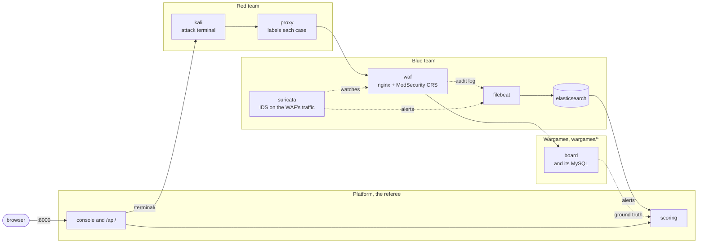

# fsl-project-mvp

A cyber attack/defence training range. A red team attacks a Django board on
MySQL, a blue team defends it with Suricata and ModSecurity, and the platform
scores what each side achieved. This repo is the
throwaway prototype; the production project lives elsewhere.

- `CLAUDE.md`: what the repo is for, how the score works, the working rules
- `docs/ARCHITECTURE.md`: how the range is put together, and where it is going
- `docs/THREAT-MODEL.md`: what the range emulates and what it leaves out
- `docs/STATE.md`: where the work stands
- `README.ko.md`, `docs/ARCHITECTURE.ko.md`: this README and the architecture in Korean

## How it fits together

### Where it runs

On the OpenStack cloud the whole stack runs inside one VM, which one Heat
stack (`deploy/openstack/platform.yaml`) creates. The platform reads the range through the OpenStack API as the
member-role user `fsl-range`; the range it scores is still the Docker one
inside the VM (backlog 2 in `docs/STATE.md` moves it onto OpenStack).


### Inside the stack

The red team attacks through the blue team's defences into a wargame; the
blue team's sensors log into Elasticsearch; the platform referees, scoring
from those alerts and from the loot the attacker proves against the target's
own data. The platform, red and blue teams are in the top `compose.yaml`; each
wargame is a folder under `wargames/` that it includes, so a new wargame is a
new folder and one more `include:` line. There is one wargame today, the
board, the single `loot_verified` target; a PHP company site is planned as the
second.



Left out to keep the lines readable: Kali's raw TCP goes straight to the WAF
without the proxy; the platform fires scripted cases at the WAF itself; and
through the substrate (`docker exec` here, ssh on OpenStack) it writes the
sensor's rules and the proxy's case label and reads the attacker's command
log, and it reads the board's ground truth directly over the estate network,
past the WAF. The networks are in `docs/ARCHITECTURE.md`.

## Bringing it up

On a host with Docker, clone the repo, fetch the GeoIP database once, and
bring the stack up:

```bash
bin/fetch-geoip
docker compose up -d --build
```

Elasticsearch's managed GeoIP downloader is off; it reads `GeoLite2-City.mmdb`
from `config/ingest-geoip` (a durable bind mount) instead. `bin/fetch-geoip`
puts it there once — the file is not committed, and it survives a container
recreate rather than being re-downloaded (the cloud's Elasticsearch cannot
reach the download CDN). The platform sorts out the docker socket group and
registers the Elasticsearch ingest pipeline (which sets evidence's event time
and geolocates source addresses) on start, so there is nothing else to run. Firing the scripted cases from the command line and
`bin/verify`, `--fast` included, need a virtualenv:

```bash
python3 -m venv .venv && .venv/bin/pip install -r platform/requirements.txt
```

| Port | | Used by |
|---|---|---|
| 8000 | the console, `/api/`, and the attacker's terminal at `/terminal/` | a person's browser |
| 9200 | Elasticsearch | the acceptance tests |

A person needs only 8000: nginx inside the platform's image takes it and
hands `/terminal/` to Kali's ttyd, which publishes no port of its own. On
the Mac every port is published on `127.0.0.1` only; on the platform VM 8000
is published on the VM's own address instead (`FSL_PUBLISH` in `.env`). The
target is not published: the command-line cases and the acceptance tests reach
it from inside the range, the way the console does. Inside the range the
target sits behind the WAF on port 80, as `http://board.com` (on the `edge`
network).

### On OpenStack

`deploy/openstack/platform.yaml` is a Heat template for the platform VM. What
it creates and what its first boot does are in `docs/ARCHITECTURE.md`
("Built: the platform VM"). As a project member, with the project's openrc
sourced and `python-heatclient` installed:

```bash
openstack stack create -t deploy/openstack/platform.yaml --parameter keystone=http://KEYSTONE:5000 fsl-platform
```

`keystone` is Keystone's base URL without `/v3`; the platform adds it. The
user is looked up in domain `default`, and the project is the stack's own.
The password never goes into the stack: Nova keeps an instance's user data,
and its metadata service serves it to whatever runs on the VM, the range's
containers included. Once the stack's `address` answers ssh, add the password
from a file, so it never reaches a command line, and recreate the platform:

```bash
{ printf 'FSL_OPENSTACK_PASSWORD='; cat PASSWORD_FILE; echo; } | ssh ubuntu@ADDRESS 'cloud-init status --wait >/dev/null && cat >> /opt/fsl/openstack.env && sudo docker compose -f /opt/fsl/compose.yaml up -d platform'
```

| Parameter | Default | |
|---|---|---|
| `ref` | `dev` | the branch or tag to clone |
| `repository` | this repo on GitHub | |
| `user` | `fsl-range` | the Keystone user the platform signs in as |
| `key_name` | `fsl-claude` | the keypair whose private key `ssh ubuntu@ADDRESS` needs |
| `image` | `ubuntu-24.04` | |
| `flavor` | `m1.windows` | |
| `external_network` | `provider` | |
| `cidr` | `10.20.0.0/24` | must not overlap the compose subnets or `172.17.0.0/16` |
| `dns` | `8.8.8.8,8.8.4.4` | |

The stack's `address` output is the floating IP, and the console is at
`http://ADDRESS:8000/`, with no login yet. The other ports stay on the VM's
loopback.

On the VM the checkout is `/opt/fsl`, owned by `ubuntu`; run compose,
`bin/backup` and the restore below there. `systemctl status fsl-platform`
shows how the last boot's bring-up went.

With the password in, the platform builds the range's networks through its
own API:

```bash
curl -s -X POST -H "Content-Type: application/json" -d "{}" http://ADDRESS:8000/api/range/fabric/
```

`GET` on the same path shows what is missing, present, drifted or left
over, and `DELETE` takes it down, refused while a server stands on it.

The range's VMs boot from golden images the platform builds from the setup
scripts `declaration.yaml` names under `hosts:`. Each POST moves every build
one step (boot a builder, stop it once its setup reports, snapshot it, delete
it), so repeat it until the answer says `"clean": true`; it takes about
seven minutes:

```bash
curl -s -X POST -H "Content-Type: application/json" -d "{}" http://ADDRESS:8000/api/range/images/
```

A failed build shows the end of its console under `detail`; `DELETE` on the
same path removes failed builders and images built from older scripts.

With the images ready, one POST boots the WAF and the board, each from its
image, and the platform reaches them over ssh on `mgmt`:

```bash
curl -s -X POST -H "Content-Type: application/json" -d "{}" http://ADDRESS:8000/api/range/slot/
```

The edge and the WAF then take their config over ssh — pfSense's WAN
addresses, pass rule, Suricata and syslog, and the WAF's ModSecurity log
forwarding — with `POST /api/range/configure/`. To reset the slot between
sessions, `POST /api/range/slot/rebuild/` Nova-rebuilds every VM from its
golden image (keeping its ports and addresses), so no edited data or
rule carries over; run `configure/` again once the VMs are back up, since the
rebuild wipes the ssh-pushed config (the board is baked and needs only the
rebuild).

The range lives outside the stack. Take it down in order, `DELETE` on
`/api/range/slot/` and then on `/api/range/fabric/`, before
`openstack stack delete fsl-platform` or a stack update that replaces the
server: the platform's ssh key lives on the VM, so a new VM makes a new key,
and the fabric reports the old keypair as drift. The images stay; they are
the slow part.

The stack boots with the keypair `key_name` names, which has to be in the
project first:

```bash
openstack keypair create --public-key PUBLIC_KEY_FILE fsl-claude
```

### The pfSense image

pfSense CE has no cloud image and no scripted install: its only installer is
Netgate's online one (`netgate-installer-v1.2-RELEASE-amd64.iso`, from a $0
Netgate Store checkout), and installing CE with it needs no account. The
cloud has no volume service, so the install goes onto a server's own root
disk through Nova's stable rescue, which boots the ISO as a CD-ROM and keeps
the server's disk attached. As `fsl-range`:

```bash
openstack image create netgate-installer --file netgate-installer.iso --disk-format iso --container-format bare --private --property hw_rescue_device=cdrom --property hw_rescue_bus=scsi --property hw_scsi_model=virtio-scsi
openstack network create fsl-pfsense-build-lan
openstack subnet create --network fsl-pfsense-build-lan --subnet-range 192.168.1.0/24 --no-dhcp --gateway none fsl-pfsense-build-lan
openstack server create --image cirros-0.6.3 --flavor m1.small --network fsl-platform --network fsl-pfsense-build-lan --wait fsl-pfsense-build
openstack server rescue --image netgate-installer fsl-pfsense-build
openstack console url show --novnc fsl-pfsense-build
```

On that console: accept the notice, Install, WAN `vtnet0` (the
`fsl-platform` port, which reaches the Internet) by DHCP, LAN `vtnet1` at
its defaults, Install CE, ZFS and GPT on `vtbd0`, the current stable
version, then Halt; Reboot would start the installer again. Then
`openstack server unrescue fsl-pfsense-build`, check that pfSense boots to
its menu, halt it with option 6, and:

```bash
openstack server image create --name fsl-pfsense --wait fsl-pfsense-build
openstack image set --property hw_vif_model=virtio --property hw_disk_bus=virtio --property os_distro=freebsd fsl-pfsense
```

Delete `fsl-pfsense-build` and the build LAN afterwards. pfSense writes to
the video console, so `openstack console log show` stays empty; use noVNC.

## Running a round

Open http://localhost:8000, start a session, and open the red and blue consoles
side by side. The language button in the header switches between English and
Korean.

- **Red** has the objectives, a Kali shell and the scripted cases. A fired
  case is labelled on the way out. Alternatively name a case, press start,
  work in the shell and press stop: everything sent in between is attributed
  to that name.
- **Blue** has a dashboard, live alerts, the scoreboard and the Suricata rules.
  It ingests on a timer. Any alert opens the Elasticsearch record behind it.

The scripted board cases can also be fired from the command line, as the
acceptance tests do. The target is not published, so the harness runs inside
the range, from the platform, the way the console fires:

```bash
docker compose exec platform \
  python redteam/run.py --target http://board.com --tool-target http://board.com
```

## Checking it

```bash
bin/verify --fast     # unit and API tests and the metrics, no stack needed
bin/verify            # also the acceptance tests in test/, against the live stack
```

The full run restarts the platform and resets the target, the rules and the
attacker's origin, so do not run it against a stack someone is using. It deletes only the sessions its own run created.
`bin/prune` deletes sessions by hand and is a dry run without `--apply`:

```bash
bin/prune --keep 20 --apply      # keep the newest 20
bin/prune --ids FILE --apply     # only the closed sessions FILE lists
```

After adding a Tailwind class to a template, run `bin/build-css`. The
stylesheet is generated and committed so the console renders without internet
access, and a test fails when it is out of date.

## Backup and restore

The platform's store (sessions, cases, detections, objectives, rule sets,
suppressions) is one SQLite file, `/data/db.sqlite3` on the `fsl_platformdata`
volume. Nothing else is backed up: not Elasticsearch's `fsl_esdata` volume,
not Filebeat's registry in `fsl_filebeatdata`, not ModSecurity's audit log in
`fsl_waflogs`, and not Suricata's `eve.json`, a plain file in
`deploy/suricata/logs`. `docker compose down -v` deletes the four volumes and
leaves that file.

```bash
bin/backup      # writes backups/db-<UTC time>.sqlite3 while the platform serves
```

It uses SQLite's online backup API, checks the copy with `PRAGMA
integrity_check`, and keeps nothing if either step fails. To reach a platform
that is not in Docker, set `FSL_PLATFORM_EXEC` to a command that runs
`python -` with the platform's settings importable.

Restore by hand, with the platform stopped:

```bash
docker compose stop platform
docker run --rm --network none --entrypoint sh --user fsl \
  -v fsl_platformdata:/data -v "$PWD/backups:/backups:ro" fsl-platform \
  -c 'rm -f /data/db.sqlite3-journal && cp /backups/db-20260925T020000Z.sqlite3 /data/db.sqlite3'
docker compose start platform
```

The image's entrypoint ignores its arguments and starts the server, so
`--entrypoint sh` replaces it. The image itself runs as root; `--user fsl`
makes the copy the platform's user's, where `docker cp` would leave it owned
by root and unwritable. The old `-journal` has to go, or SQLite would replay
it onto the restored file. On start the platform applies any migration the
backup predates. The copy has been checked on a scratch volume (it lands
owned by `fsl`); the whole procedure has not been run against a live stack.

## Local lab only

Elasticsearch runs without security and Django with `DEBUG=1`. Django answers
only to `localhost`, `127.0.0.1` and `[::1]` unless `DJANGO_ALLOWED_HOSTS`
names more; the platform VM adds its floating IP. The Docker
socket is mounted into the platform, and the Kali shell at `/terminal/` is an
unauthenticated root shell. Both are container escape paths.

The same holds on the platform VM. There the project's password is also plain
text in `/opt/fsl/openstack.env` and in the platform container's environment.
The VM's ssh and 8000 are open to any address, and 8000 asks for no login.
