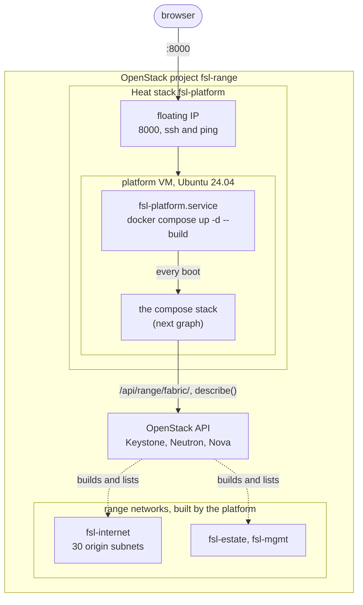
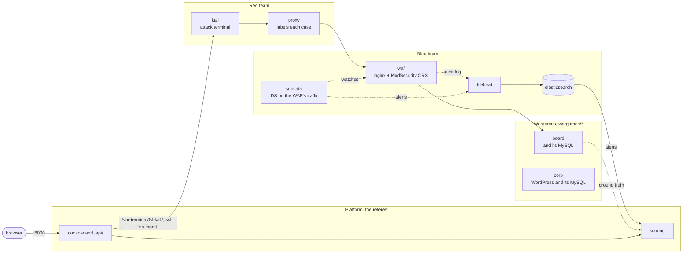

# fsl-project-mvp

A cyber attack/defence training range. A red team attacks two targets behind
the WAF, a Django board and a WordPress corporate site, each with its own
MySQL. A blue team defends with Suricata and ModSecurity, and the platform
scores both sides. This repo is a throwaway prototype; the production project
lives elsewhere.

- `CLAUDE.md`: what the repo is for, how the score works, the working rules
- `docs/superpowers/specs/2026-10-08-composable-isolated-learning-mvp-design.md`:
  the approved direction (2026-10-08); parts of it are not built yet
- `docs/ARCHITECTURE.md`: how the range is put together, and where it is going
- `docs/THREAT-MODEL.md`: what the range emulates and what it leaves out
- `docs/STATE.md`: where the work stands
- `README.ko.md`, `docs/ARCHITECTURE.ko.md`: this README and the architecture in Korean

## How it fits together

### Where it runs

On the OpenStack cloud the whole stack runs inside one VM, which one Heat
stack (`deploy/openstack/platform.yaml`) creates. The platform drives the
range through the OpenStack API as the member-role user `fsl-range`. On the VM
`FSL_SUBSTRATE=range.openstack.connect`, so the scored range is the OpenStack
slot, and a session cannot start until `/api/range/ready/` reports that slot
ready.



### Inside the stack

The red team attacks a wargame through the blue team's WAF and IDS. The
sensors' alerts go to Elasticsearch. The platform scores from those alerts and
from the target's own records (ground truth): exfiltrated data the attacker
submits is checked against the target's data. The platform, red and blue
teams are in the top `compose.yaml`, which includes one folder per wargame
under `wargames/`. A new wargame needs that folder with its `compose.yaml`,
`scenario.yaml` and `objectives.yaml`, a case file under `redteam/cases/`, and
one more `include:` line; `platform/wargames.py` discovers it from
`scenario.yaml`. There are two wargames: the board (`loot_verified`) and corp,
a WordPress site (`effect_observed`).



Not drawn: Kali's raw TCP goes straight to the WAF without the proxy, and the
platform fires scripted cases at the WAF itself. Through the substrate runner
(`docker exec` on compose, ssh on OpenStack) the platform writes the sensor's
rules and the proxy's case label, reads the attacker's command log, and reads
corp-db's MySQL binary log (`mysqlbinlog`); corp is scored by observed effect,
not by submitted data. The board's ground truth (its `auth_user` table) is read
over HTTP from the board itself (`BOARD_API_URL`), bypassing the WAF. The red
terminal is a ttyd inside the platform that ssh's to Kali's `mgmt` address; on
compose Kali has no `mgmt` address, so the pane does not connect there. The
networks are in `docs/ARCHITECTURE.md`.

## Bringing it up

On a host with Docker, clone the repo, fetch the GeoIP database once, and
bring the stack up:

```bash
bin/fetch-geoip
docker compose up -d --build
```

Elasticsearch's managed GeoIP downloader is off; it reads `GeoLite2-City.mmdb`
from `config/ingest-geoip` (a durable bind mount) instead. `bin/fetch-geoip`
puts it there once. The file is not committed and survives a container
recreate (the cloud's Elasticsearch cannot reach the download CDN). On start
the platform sets the docker socket group and registers the Elasticsearch
ingest pipeline, which sets each event's time and geolocates source addresses.
Firing the scripted cases from the command line and `bin/verify`, `--fast`
included, need a virtualenv:

```bash
python3 -m venv .venv && .venv/bin/pip install -r platform/requirements.txt
```

| Port | | Used by |
|---|---|---|
| 8000 | the console, `/api/`, Kali's own ttyd at `/terminal/`, and the terminals at `/vm-terminal/fsl-kali/` and `/vm-terminal/fsl-waf/` | a person's browser |
| 5140/udp | Filebeat's syslog input | pfSense and the WAF on OpenStack |
| 9200 | Elasticsearch | the acceptance tests |

nginx inside the platform image serves 8000. It passes `/terminal/` to the ttyd
on the Kali container (compose) and `/vm-terminal/` to ttyd processes inside the
platform, which ssh to the host's `mgmt` address.
By default every port is published on `127.0.0.1`.
On the platform VM, 8000 is published on the VM's own address
(`FSL_PUBLISH`) and 5140/udp on `0.0.0.0` (`FSL_SYSLOG_PUBLISH`). The target is
not published: the command-line cases and the acceptance tests reach it from
inside the range, as the console does. Inside the range the
targets sit behind the WAF on port 80: `http://board.com` (aliased on the
`edge` network) and `http://corp.com` (a vhost reached by the `Host` header).

### On OpenStack

`deploy/openstack/platform.yaml` is a Heat template for the platform VM. What
it creates and what its first boot does are in `docs/ARCHITECTURE.md`
("Built: the platform VM"). As a project member, with the project's openrc
sourced and `python-heatclient` installed:

```bash
openstack stack create -t deploy/openstack/platform.yaml --parameter keystone=http://KEYSTONE:5000 fsl-platform
```

`keystone` is Keystone's base URL without `/v3`; the platform adds it. The
user is looked up in domain `default`, and the project is the stack's own.
The password stays out of the stack, because Nova's metadata service serves
user data to every process on the VM, containers included. Once the stack's
`address` answers ssh, add the password from a file and recreate the platform:

```bash
{ printf 'FSL_OPENSTACK_PASSWORD='; cat PASSWORD_FILE; echo; } | ssh ubuntu@ADDRESS 'cloud-init status --wait >/dev/null && cat >> /opt/fsl/openstack.env && sudo docker compose -f /opt/fsl/compose.yaml up -d platform'
```

| Parameter | Default | |
|---|---|---|
| `ref` | `dev` | the branch or tag to clone |
| `repository` | this repo on GitHub | |
| `user` | `fsl-range` | the Keystone user the platform signs in as |
| `key_name` | `fsl-claude` | the keypair whose private key `ssh ubuntu@ADDRESS` needs |
| `image` | `ubuntu-24.04` | |
| `flavor` | `m1.windows` | |
| `external_network` | `provider` | |
| `cidr` | `10.20.0.0/24` | must not overlap the compose subnets or `172.17.0.0/16` |
| `dns` | `8.8.8.8,8.8.4.4` | |

The stack's `address` output is the floating IP. The console is at
`http://ADDRESS:8000/` and does not ask for a login. 9200 stays
on the VM's loopback; 5140/udp listens on all of the VM's addresses.

On the VM the checkout is `/opt/fsl`, owned by `ubuntu`; run compose,
`bin/backup` and the restore below there. `systemctl status fsl-platform`
shows how the last boot's bring-up went.

With the password in, the platform builds the range's networks through its
own API:

```bash
curl -s -X POST -H "Content-Type: application/json" -d "{}" http://ADDRESS:8000/api/range/fabric/
```

`GET` shows what is missing, present, drifted or left over; `DELETE` takes it
down, and is refused while a server is attached.

The range's VMs boot from golden images the platform builds from the setup
scripts `declaration.yaml` names under `hosts:`. Each POST moves every build
one step (boot a builder, stop it once its setup reports, snapshot it, delete
it), so repeat it until the answer says `"clean": true`; it takes about
seven minutes:

```bash
curl -s -X POST -H "Content-Type: application/json" -d "{}" http://ADDRESS:8000/api/range/images/
```

A failed build shows the end of its console under `detail`; `DELETE` on the
same path removes failed builders and images built from older scripts.

With the images ready, one POST boots `fsl-pfsense`, `fsl-kali`, `fsl-waf`
and `fsl-wg-board`, each from its image, and the platform reaches them over ssh
on `mgmt`:

```bash
curl -s -X POST -H "Content-Type: application/json" -d "{}" http://ADDRESS:8000/api/range/slot/
```

`POST /api/range/configure/` then pushes config over ssh: pfSense's WAN
addresses, pass rule, Suricata and syslog, and the WAF's ModSecurity log
forwarding. `POST /api/range/slot/rebuild/` Nova-rebuilds every VM from its
golden image, keeping its ports and addresses, so no edited data or rule
carries over; closing a session calls it. The rebuild wipes the pushed config,
so run `configure/` again once the VMs are up (the board is baked into its
image and needs only the rebuild).

The range lives outside the stack. Before `openstack stack delete
fsl-platform` or a stack update that replaces the server, `DELETE`
`/api/range/slot/` and then `/api/range/fabric/`: a new VM makes a new ssh
key, and the fabric reports the old keypair as drift. The images stay.

The stack boots with the keypair `key_name` names, which has to be in the
project first:

```bash
openstack keypair create --public-key PUBLIC_KEY_FILE fsl-claude
```

### The pfSense image

pfSense CE has no cloud image and no scripted install. Its only installer is
Netgate's online one (`netgate-installer-v1.2-RELEASE-amd64.iso`, from a $0
Netgate Store checkout), which installs CE without an account. The cloud has
no volume service, so the install goes onto a server's root disk through
Nova's stable rescue, which boots the ISO as a CD-ROM with the disk attached.
As `fsl-range`:

```bash
openstack image create netgate-installer --file netgate-installer.iso --disk-format iso --container-format bare --private --property hw_rescue_device=cdrom --property hw_rescue_bus=scsi --property hw_scsi_model=virtio-scsi
openstack network create fsl-pfsense-build-lan
openstack subnet create --network fsl-pfsense-build-lan --subnet-range 192.168.1.0/24 --no-dhcp --gateway none fsl-pfsense-build-lan
openstack server create --image cirros-0.6.3 --flavor m1.small --network fsl-platform --network fsl-pfsense-build-lan --wait fsl-pfsense-build
openstack server rescue --image netgate-installer fsl-pfsense-build
openstack console url show --novnc fsl-pfsense-build
```

On that console: accept the notice, Install, WAN `vtnet0` (the
`fsl-platform` port, which reaches the Internet) by DHCP, LAN `vtnet1` at
its defaults, Install CE, ZFS and GPT on `vtbd0`, the current stable
version, then Halt; Reboot would start the installer again. Then
`openstack server unrescue fsl-pfsense-build`, check that pfSense boots to
its menu, halt it with option 6, and:

```bash
openstack server image create --name fsl-pfsense --wait fsl-pfsense-build
openstack image set --property hw_vif_model=virtio --property hw_disk_bus=virtio --property os_distro=freebsd fsl-pfsense
```

Delete `fsl-pfsense-build` and the build LAN afterwards. pfSense writes to
the video console, so `openstack console log show` stays empty; use noVNC.

## Running a round

Open http://localhost:8000, start a session, and open the red and blue consoles
side by side. The language button in the header switches between English and
Korean.

- **Red** has the objectives, a Kali shell and the scripted cases. A fired
  case is labelled on the way out. Alternatively name a case, press start,
  work in the shell and press stop: everything sent in between is attributed
  to that name.
- **Blue** is a sidebar of framed tools: Kibana and a WAF terminal. The
  scoreboard appears on the session page when the session closes.

The scripted cases can also be fired from the command line, as the acceptance
tests do. The target is not published, so the harness runs inside the range,
from the platform:

```bash
docker compose exec platform \
  python redteam/run.py --target http://board.com --tool-target http://board.com
```

The harness opens the session of the scenario whose `case_file` matches the
`--cases` basename (`board.yaml` opens board, `corp.yaml` opens corp, anything
else opens board), and `--target` defaults to that scenario's `public_url`.
For corp: `--cases redteam/cases/corp.yaml`.

## Checking it

```bash
bin/verify --fast     # unit and API tests and the metrics, no stack needed
bin/verify            # also the acceptance tests in test/, against the live stack
```

The full run restarts the platform and resets the target, the rules and the
attacker's origin, so do not run it against a stack someone is using. It
deletes only the sessions it created.
On a platform that does not listen on localhost (the OpenStack platform VM),
run it on that host with `FSL_PLATFORM_URL=http://<address>:8000 bin/verify`;
tests that exercise the compose range are skipped when the platform reports
another substrate.
`bin/prune` deletes sessions by hand and is a dry run without `--apply`:

```bash
bin/prune --keep 20 --apply      # keep the newest 20
bin/prune --ids FILE --apply     # only the closed sessions FILE lists
```

After adding a Tailwind class to a template, run `bin/build-css`; the
generated stylesheet is committed, and a test fails when it is stale.

## Backup and restore

The platform's store (sessions, cases, detections, objectives, rule sets,
suppressions) is one SQLite file, `/data/db.sqlite3` on the `fsl_platformdata`
volume. Nothing else is backed up: not Elasticsearch's `fsl_esdata` volume,
not Filebeat's registry in `fsl_filebeatdata`, not ModSecurity's audit log in
`fsl_waflogs`, and not Suricata's `eve.json`, a plain file in
`deploy/suricata/logs`. `docker compose down -v` deletes the four volumes and
leaves that file.

```bash
bin/backup      # writes backups/db-<UTC time>.sqlite3 while the platform serves
```

It uses SQLite's online backup API, checks the copy with `PRAGMA
integrity_check`, and keeps nothing if either step fails. To reach a platform
that is not in Docker, set `FSL_PLATFORM_EXEC` to a command that runs
`python -` with the platform's settings importable.

Restore by hand, with the platform stopped:

```bash
docker compose stop platform
docker run --rm --network none --entrypoint sh --user fsl \
  -v fsl_platformdata:/data -v "$PWD/backups:/backups:ro" fsl-platform \
  -c 'rm -f /data/db.sqlite3-journal && cp /backups/db-20260925T020000Z.sqlite3 /data/db.sqlite3'
docker compose start platform
```

`--entrypoint sh` replaces the image's entrypoint, which ignores its
arguments. `--user fsl` leaves the copy owned by the platform's user;
`docker cp` would leave it owned by root and unwritable. The old `-journal`
must go, or SQLite replays it onto the restored file. On start the platform
applies any newer migrations. The copy step was checked on a scratch volume;
the whole procedure has not been run against a live stack.

## Local lab only

Elasticsearch runs without security and Django with `DEBUG=1`. Django answers
only to `localhost`, `127.0.0.1` and `[::1]` unless `DJANGO_ALLOWED_HOSTS`
names more; the platform VM adds its floating IP. The Docker socket is
mounted into the platform, a container escape path. `/terminal/` is an
unauthenticated root shell on Kali, and the terminals under `/vm-terminal/` need
no login of their own and give a shell on Kali and the WAF.

The same holds on the platform VM. There the project's password is also plain
text in `/opt/fsl/openstack.env` and in the platform container's environment.
The VM's ssh and 8000 are open to any address, and 8000 asks for no login.
